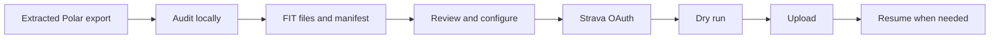

# Polar Activity Migrator

Polar Activity Migrator is a local command-line tool for moving historical Polar Flow
training sessions to Strava while preserving the workout data available in a Polar
user-data export. It builds a reviewable migration workspace before anything is uploaded.

> [!IMPORTANT]
> This independent project is not affiliated with, endorsed by, or sponsored by Polar
> Electro or Strava. Your Polar export contains sensitive personal data. Keep the export
> and migration workspace private.

## Overview

Use the tool when you want to migrate a Polar training history rather than download and
upload individual activities by hand. Conversion and auditing happen on your computer.
Workout data leaves your computer only when you explicitly run a non-dry-run Strava upload.



The normal workflow is:

1. Request and extract your Polar user-data export.
2. Install Polar Activity Migrator.
3. Run `audit` to create a portable migration workspace.
4. Review the audit reports and resolve activities that require configuration.
5. Create a Strava API application and authorize the workspace.
6. Run a local dry run, then upload a small batch.
7. Start the full upload and resume later if it is interrupted or reaches an API limit.

## Features

- Recursively discovers Polar `training-session-*.json` files; daily
  `activity-*.json` files are not treated as workouts.
- Supports multiple exercises per training session, laps, GPS, heart rate, distance,
  speed, cadence, altitude, temperature, calories, and mapped sports when present.
- Uses one validated Activity domain model for FIT and TCX export.
- Produces CRC-validated FIT files and decodes them again during audit.
- Creates JSON, CSV, and Markdown audit reports plus a versioned migration manifest.
- Flags timezone, source validity, sensor-loss, and possible duplicate issues for review.
- Uploads only manifest-approved FIT files after verifying their SHA-256 hashes.
- Stores resumable upload state in SQLite and preserves known Strava upload IDs.
- Uses bounded bulk submission, adaptive Strava rate-limit handling, and live progress.

FIT is the preferred format for Strava migration. TCX remains available for individual
or directory conversion with `convert --format tcx`.

## Data preservation

The importer preserves values that are present and supported by the source and target
formats. Missing values stay missing. The tool does not invent trackpoints, guess unknown
timezones, or silently clamp unrepresentable measurements. See
[FIT export details](docs/fit-export.md) and the
[Polar training-session model](docs/polar-training-session.md).

## Requirements

- [Python 3.12 or newer](https://www.python.org/downloads/)
- [Git](https://git-scm.com/downloads/) for cloning the repository
- A Polar user-data export extracted to a directory
- A Strava account and Strava API application for uploading

## Installation

Clone the repository and install its declared dependencies in a virtual environment.

```text
git clone https://github.com/juho1337/polar-to-strava.git
cd polar-to-strava
python -m venv .venv
```

Windows PowerShell:

```powershell
.\.venv\Scripts\Activate.ps1
python -m pip install --upgrade pip
python -m pip install -e .
python main.py --help
```

macOS or Linux:

```bash
source .venv/bin/activate
python -m pip install --upgrade pip
python -m pip install -e .
python main.py --help
```

The editable install also provides a `polar-to-strava` command. This guide uses
`python main.py` so commands are unambiguous from a repository checkout. See the
[installation guide](docs/installation.md) for verification and common setup problems.

## Export your data from Polar

Request your data from Polar Account using Polar's official
[download instructions](https://support.polar.com/us-en/how-to-download-all-your-data-from-polar-flow).
Download the archive and extract it before running this tool. Pass the extracted root
directory to `audit`; the scanner finds supported training sessions recursively. You do
not need to select thousands of JSON files manually.

See [Polar export preparation](docs/polar-export.md) for details.

## Create a migration workspace

Windows PowerShell:

```powershell
python main.py audit "C:\path\to\polar-export" --output "C:\path\to\migration-workspace"
```

macOS or Linux:

```bash
python main.py audit ~/Downloads/polar-export --output ~/polar-migration
```

The audit discovers training sessions, parses and validates activities, generates and
verifies FIT files, writes reports and manifests, and identifies items requiring review.
It does **not** contact Strava.

The workspace contains:

```text
migration-workspace/
├── fits/
├── migration-audit.json
├── migration-audit.csv
├── migration-audit.md
├── migration-manifest.json
├── migration-manifest.csv
└── migration-config.template.json
```

Start with `migration-audit.md`, then use the CSV or JSON files for more detail. The
uploader consumes `migration-manifest.json`; do not hand-edit it. See
[Migration workspace](docs/migration-workspace.md).

## Resolve activities requiring configuration

An activity can require configuration when its local timestamps contain no deterministic
timezone. Copy `migration-config.template.json` to a private file and set only offsets
you can verify. Do not guess.

```json
{
  "config_version": 1,
  "activity_overrides": {
    "sha256:EXAMPLE_ACTIVITY_ID": {
      "timezone_offset": "+02:00"
    }
  },
  "review_requirements": {}
}
```

Rerun the audit with the configuration:

```powershell
python main.py audit "C:\path\to\polar-export" `
  --output "C:\path\to\migration-workspace" `
  --config "C:\private\migration-config.json" --overwrite
```

Summary-only workouts, invalid source records, unresolved sensor loss, and activities
with unrepresentable data remain excluded rather than being fabricated. Possible
duplicates are warnings for human review; the audit never deletes them automatically.

## Connect to Strava

The current uploader requires your own Strava API application. Follow the detailed
[Strava setup and OAuth guide](docs/strava-setup.md), then set the credentials in the
current shell.

Windows PowerShell:

```powershell
$env:STRAVA_CLIENT_ID="YOUR_CLIENT_ID"
$env:STRAVA_CLIENT_SECRET="YOUR_CLIENT_SECRET"
python main.py strava auth "C:\path\to\migration-workspace"
```

macOS or Linux:

```bash
export STRAVA_CLIENT_ID="YOUR_CLIENT_ID"
export STRAVA_CLIENT_SECRET="YOUR_CLIENT_SECRET"
python main.py strava auth ~/polar-migration
```

The CLI prints an authorization URL and requests only `activity:write`. It does not run a
localhost callback server. After authorizing, a browser connection error at localhost is
expected: copy the `code` query value, then enter the granted `scope` value when prompted.
Do not paste the whole callback URL.

Never commit the client secret or `.strava-tokens.json`, and never post authorization
codes, access tokens, or refresh tokens in an issue.

## Dry run and upload

Inspect local progress first:

```powershell
python main.py strava status "C:\path\to\migration-workspace" --details
```

Validate selection, paths, and FIT hashes without making a Strava request:

```powershell
python main.py strava upload "C:\path\to\migration-workspace" --dry-run --limit 5
```

Upload a small real batch and verify it in Strava before starting the full migration:

```powershell
python main.py strava upload "C:\path\to\migration-workspace" --limit 5
python main.py strava upload "C:\path\to\migration-workspace" --all
```

Exactly one selector is required:

- `--limit N`: select at most N new or retryable activities and also resume matching
  activities already processing.
- `--activity-id ID`: select one manifest activity by stable ID.
- `--all`: select all eligible pending, retryable, and processing activities.

`--from` and `--to` accept `YYYY-MM-DD` filters. The safe defaults are three in-flight
uploads (`--max-in-flight 3`) and a ten-request API reserve
(`--rate-limit-reserve 10`). Increasing concurrency or reducing the reserve is usually
unnecessary.

## Monitor and resume

Overall progress means:

```text
resolved eligible activities / total eligible activities
```

Resolved includes completed uploads and authoritative duplicate responses from Strava.
Processing, retryable, uncertain, and other problem states do not count as migrated.
Duplicates and review states remain visible separately.

```text
Strava migration
Resolved       12 / 100 (12.00%)
Migrated       11
Duplicates      1
Remaining      88
Processing      3
Retryable       0
Needs review    0
```

`strava status` reads only the local manifest and SQLite state, so it consumes no Strava
quota. If the process is interrupted or a rate limit stops it, resume with:

```powershell
python main.py strava upload "C:\path\to\migration-workspace" --all
```

> [!WARNING]
> Do not delete `migration-state.sqlite3` during a migration. It prevents completed
> activities from being selected again and preserves accepted Strava upload IDs.

Actual Strava limits vary. The uploader reads overall and read-specific response headers,
pauses at short-window reserves, and stops safely at daily reserves. Large migrations can
therefore span multiple days. See [Resumable Strava uploader](docs/strava-uploader.md).

## Command reference

| Command | Purpose |
| --- | --- |
| `audit INPUT --output PATH [--config FILE] [--overwrite]` | Build or regenerate a FIT migration workspace. |
| `scan [--config FILE] [--verbose]` | List training-session files using the YAML scanner configuration. |
| `inspect FILE` | Show imported measurements and validation issues for one session file. |
| `convert INPUT --output PATH [--format tcx\|fit] [--overwrite]` | Convert one file or an export directory; TCX is the default. |
| `strava auth WORKSPACE [--redirect-uri URI]` | Authorize and store workspace tokens. |
| `strava status WORKSPACE [--details]` | Show local migration progress without an API request. |
| `strava upload WORKSPACE SELECTOR [OPTIONS]` | Dry-run or upload manifest activities. |
| `strava reset WORKSPACE --activity-id ID [--force]` | Explicitly reset local state; it never deletes a Strava activity. |

Upload selectors are `--limit N`, `--activity-id ID`, and `--all`. Upload options also
include `--dry-run`, `--from YYYY-MM-DD`, `--to YYYY-MM-DD`, `--max-in-flight`, and
`--rate-limit-reserve`. Run any command with `--help` for its current interface.

## Privacy and security

Polar exports and generated artifacts can reveal GPS routes, timestamps, heart rate,
training history, device information, and other personal fitness data. Keep the original
export, FIT files, reports, manifest, token file, and SQLite state private. The repository
ignores common generated migration artifacts, but place real data outside the checkout as
an additional safeguard. See [Privacy and security](docs/privacy.md).

## Known limitations

- Activities without deterministic timezone information require a verified manual offset.
- Invalid source timestamps and summary-only records without workout samples can be excluded.
- Altitude outside the FIT representation range is excluded rather than clamped.
- Ambiguous Polar left-crank or left-pedal power is intentionally not exported as total power.
- Some Polar sports map to generic FIT or Strava categories.
- Strava can identify activities already present in the account as duplicates.
- A network interruption during POST can leave an `uncertain` outcome that requires review.
- Strava API limits can make a large migration span multiple days.
- FIT is preferred for Strava migration; TCX remains supported but may be interpreted
  differently by Strava.

## Troubleshooting

See [Troubleshooting](docs/troubleshooting.md) for installation, discovery, timezone,
OAuth, FIT integrity, upload-state, duplicate, rate-limit, and interruption guidance.
Do not edit the SQLite database manually or blindly reset an `uncertain` upload.

## Development

Install development dependencies with `python -m pip install -e ".[dev]"`, then run:

```text
pytest
ruff check .
black --check .
mypy .
```

See [CONTRIBUTING.md](CONTRIBUTING.md) and [SECURITY.md](SECURITY.md).

## License

Polar Activity Migrator is licensed under the
[GNU General Public License version 3](LICENSE). You may use, modify, and redistribute
the project under the terms of GPLv3.
