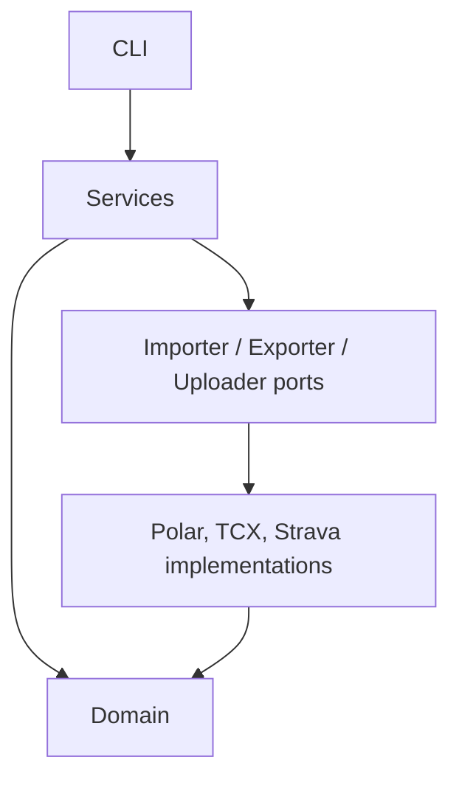
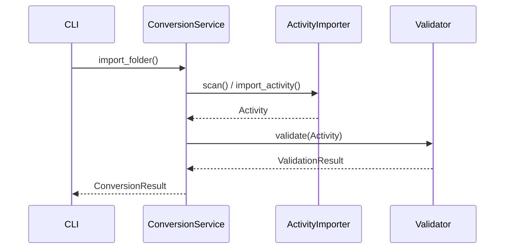

# Architecture

PolarToStrava uses a dependency direction that keeps source formats and output
formats out of the business domain.

## Layers

- **`domain/`** contains immutable `Activity` values and has no knowledge of Polar,
  TCX, Strava, filesystems, or HTTP.
- **Importers** translate a provider format into the domain. `PolarImporter` is the
  current adapter and returns `Activity` values only. Its scanner selects recorded
  `training-session-*.json` workouts and excludes daily `activity-*.json` tracking.
- **`services/`** orchestrates importer ports and validators. `ConversionService`
  scans folders, imports activities, and returns structured results. Its conversion
  methods build validated TCX and write it to disk; they do not upload.
- **Exporters** build bytes in memory through `ActivityExporter`. TCX is split
  into a `TCXBuilder` and `TCXWriter`, so building is independently testable and a
  future writer can target a filesystem, stream, zip archive, or cloud store.
- **Uploaders** can implement `ActivityUploader` for future remote destinations.

## Validation and errors

Validators never throw for malformed activities. They return `ValidationResult`,
containing structured `ValidationIssue` values at warning or error severity. Import,
export, configuration, and upload failures use the `PolarToStravaError` hierarchy,
which lets the CLI present a single user-friendly error boundary.

## Extension points

New sources implement `ActivityImporter`; new in-memory formats implement
`ActivityExporter`; and future remote destinations can implement `ActivityUploader`.
