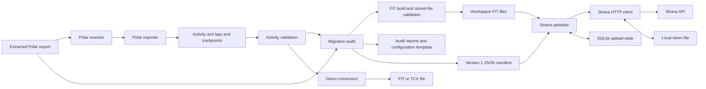
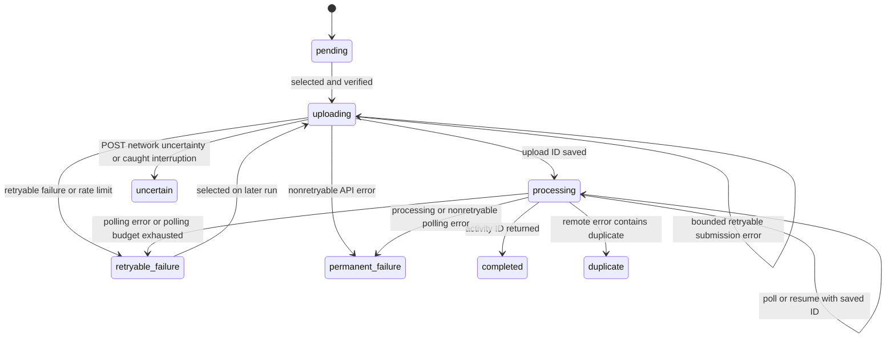

# Architecture

This document describes the implementation, including its current limits. Detailed
format evidence and user workflows remain in the linked feature guides. The goals are
deterministic conversion, preservation of supported observations, explicit ambiguity,
local inspection before network use, and durable upload outcomes.

## Context and data flow

`polar-to-strava` invokes `core.cli:app`; `python main.py` is the compatibility entry
point to the same Typer application. `scan`, `inspect`, `convert` and `audit` operate
locally. `strava auth` exchanges credentials with Strava; real `strava upload` sends FIT
data and polls remote processing, refreshing tokens when necessary. Status and dry-run
make no API requests, but can create/reconcile local SQLite state.


```mermaid
flowchart LR
    Source[Extracted Polar export] --> Discovery[Polar scanner]
    Discovery --> Import[Polar importer]
    Import --> Domain[Activity and laps and trackpoints]
    Domain --> Validate[Activity validation]
    Validate --> Audit[Migration audit]
    Source --> Audit
    Audit --> FIT[FIT build and stored-file validation]
    FIT --> Workspace[Workspace FIT files]
    Audit --> Reports[Audit reports and configuration template]
    Audit --> Manifest[Version 1 JSON manifest]
    Validate --> Convert[Direct conversion]
    Convert --> Formats[FIT or TCX file]
    Manifest --> Upload[Strava uploader]
    Workspace --> Upload
    Upload --> Client[Strava HTTP client]
    Client --> API[Strava API]
    Client <--> Tokens[Local token file]
    Upload <--> State[SQLite upload state]
```

The diagram separates two workflows: direct conversion returns files, while audit builds
the FIT workspace and upload manifest. TCX conversion does not feed the current uploader.
Audit also reads source JSON for inventory/review metadata; the domain is not its only
input. Neither local validation nor an eligible manifest proves Strava acceptance.

## Responsibilities and dependencies

| Package/module | Responsibility and dependencies |
| --- | --- |
| `core/cli.py` | CLI composition, options, service/client construction and Rich presentation |
| `core/contracts.py`, `core/errors.py` | Import/export/upload protocols and application error types |
| `core/audit_progress.py` | Rich adapter for service audit events; no migration decisions |
| `domain/models.py` | Pydantic activity, lap, observation and measurement values; no provider implementation, HTTP or filesystem imports |
| `polar/` | Deterministic discovery, JSON loading, legacy and training-session parsing, source-specific errors |
| `services/conversion.py` | Injected importer/validator orchestration; concrete FIT/TCX builders and writers |
| `services/audit.py` | Polar-aware source inventory, worker orchestration, stored FIT checks, reports and manifest writing |
| `services/migration.py` | Source/FIT hashes, versioned manual timezone configuration and eligibility classification |
| `services/service_models.py`, `services/validation.py` | Structured results, framework-neutral audit progress and activity validation |
| `fit/` | In-memory FIT encoding and decode checks through fit-tool; separate filesystem writer |
| `tcx/`, `serialization/` | Composed XML serializers, bundled XSD/HR checks, byte writer and generic serialization protocols |
| `strava/` | Manifest/API models, HTTP/OAuth client, token storage, uploader, SQLite state, rate policy and progress |
| `config/` | YAML settings loader used by `scan` |
| `db/` | Package placeholder; actual upload persistence lives in `strava/state.py` |
| `tests/` | Local domain, import/export, audit, CLI and mocked upload regressions |

Preserve these dependency boundaries:

- Domain models know common source/sport enums, not provider parsing or Strava clients.
- Importers translate source data into `Activity`; exporters consume `Activity`, never
  Polar JSON. `FITWriter`/`TCXWriter` accept bytes and a destination, not domain objects.
- `ConversionService` uses `ActivityImporter` and `Validator` protocols, but constructs
  concrete exporters. `MigrationAudit` additionally imports `PolarImporter`, reads Polar
  fields and calls FIT helpers. It is not a provider-independent service layer.
- `Uploader` consumes manifest models and FIT files. It imports `file_sha256` from
  `services.migration`, but does not import the Polar parser. Network access is behind
  its `UploadClient` protocol and the injected `StravaClient`.
- `ActivityUploader` in `core/contracts.py` is an extension protocol, not the interface
  implemented by the manifest-driven `Uploader`. Do not conflate those contracts.
- Keep presentation separate where established. `core/` is not uniformly low-level:
  CLI and renderer modules depend on services. `strava/progress.py` currently combines
  pure snapshot calculations with Rich rendering.

## Activity domain

`Activity` holds source identity, sport, aware start/end times, summaries, optional
device/zones, and a tuple of `Lap` values. Each lap holds ordered `TrackPoint` values.
Points can carry GPS, independent altitude, heart rate, cadence, distance, speed,
temperature and explicit total power. Missing measurements are `None`; altitude does
not require GPS. `recorded_altitude_m` prefers independent altitude, then legacy
`Location.altitude_m`. Domain units are metres, seconds, m/s, bpm, watts and Celsius.

Models are frozen and reject unknown fields. Validated extensions and zones use read-only
mappings; JSON-shaped nested dictionaries/lists/sets are frozen. This is not a guarantee
for arbitrary objects inside `Any`, or values injected through unvalidated
`model_copy(update=...)`. Laps require ordered points within their bounds; activity lap
indexes are consecutive and lap bounds lie within the activity. The flattened
`Activity.trackpoints` concatenates laps; it does not deduplicate or globally sort them.

There is no independent Exercise domain class. Training-session exercises are combined
into one activity; mixed sports become `other`, while original sports and selected
exercise metadata remain in extensions. Elapsed time is end minus start; Polar recorded
duration is retained separately. Not every domain field is exported by every format.

## Polar import

The scanner recursively selects case-insensitive `training-session-*.json`, sorted by
filename and path. It enumerates and sorts before yielding; it is not streaming directory
order. Daily `activity-*.json` files are excluded. Direct file parsing also supports the
legacy sample-group format. `polar/models.py` retains older source models but is not
the current domain parsing pipeline.

The JSON root must be an object. `exercises` or `startTime` selects training-session
parsing; daily summary/date objects are rejected. Loading errors and invalid source
semantics become distinct Polar import errors. Construction enforces domain constraints;
`ActivityValidator` adds structured issues rather than duplicating every field check.

Training-session rules include:

- Numeric exercise `timezoneOffset`/`timeZoneOffset`, then session `timeZoneOffset`,
  supplies a fixed offset. Naive times use that offset; aware times retain theirs.
  Relative `PT...` sample times anchor to exercise start. No machine-local timezone or
  DST inference occurs. The parser currently requires a numeric offset or manual override
  even when timestamps already contain offsets; aware strings alone do not bypass
  `_offset`. A verified audit override must not conflict with authoritative source time.
- Separate populated sensor streams join on absolute timestamp **and observation ordinal**.
  Equal-time observations retain order; no Cartesian multiplication or fabricated time
  offsets. Empty values do not create measurements. Speed is converted from km/h to m/s.
- Non-route samples must lie within their exercise. Route points may extend outside the
  exercise but must remain within session bounds; the extension is reported.
- A populated standalone altitude stream takes precedence for the whole exercise.
  Route altitude is a fallback only when that stream is absent. Ambiguous left-crank
  power is not interpreted as total power or doubled.
- Explicit lap times are used; cumulative split/duration laps are reconstructed only
  when consistent, including zero-based source lap numbers when supplied. Without
  explicit laps, recorded points share one session lap. Summary-only sessions have none.
- If only session-bounded route extensions fall outside explicit laps, all points use
  one session lap and original laps remain in extensions with a warning. Other uncovered
  samples are rejected. Lap point selection uses inclusive endpoints, so a point exactly
  at a shared boundary can occur in both laps; current tests do not establish uniqueness
  at that boundary.

See [training-session mapping](polar-training-session.md),
[compatibility evidence](sprint-8-1-compatibility.md) and
[altitude/power policy](polar-altitude-power.md).

## Export and validation

FIT is the audit/upload format; direct `convert` still defaults to TCX.
Both builders return bytes before writers touch output files. Conversion services check
overwrite policy; the writers themselves create parents and replace destination content.

`FITBuilder` uses pinned `fit-tool==0.9.16`, emits file identity, timer events, records,
laps, one session and one activity summary, then decodes with CRC and semantic checks.
Checks cover message/record counts, timestamps, sensor values and session fields.
Audit separately decodes the stored file, including existing files on rerun, and compares
it to the imported domain. This catches stale or corrupt output before eligibility.
Whole-second timestamps round half-up; sensor precision is format-limited. Cadence and
temperature round to integers. Unrepresentable altitude is rejected, not clamped.
No synthetic record makes a summary-only activity exportable. See [FIT export](fit-export.md).

`TCXBuilder` composes activity/lap/trackpoint serializers, checks exportability, validates
against bundled Garmin XSDs, then compares the timestamped HR stream to the domain.
TCX XML parsing disables entity resolution and network access for generated documents.
TCX has narrower sport mapping; it does not serialize temperature, arbitrary extensions,
zones or all device metadata. Required lap summaries include established fallbacks
(distance from sample range or zero, calories initially zero; one-lap activity calories
can replace that value). These are format conventions, not recorded sensor values.
See [serialization](serialization.md).

Syntactic validity, semantic preservation and Strava display behavior are different
checks. Historical manual FIT acceptance is recorded in the feature documentation.
The [TCX HR finding](strava-heart-rate-diagnosis.md) remains unresolved; passing local
TCX checks does not prove a continuous Strava HR graph.

## Audit, workspace and manifest

`MigrationAudit.run` discovers files, hashes source bytes, validates configuration and
processes activities using `ProcessPoolExecutor` with up to eight workers, bounded by
CPU count and source count. Importer/validator objects passed to workers must be
serializable. Ordered `executor.map` results keep report order stable; a slow early
item can delay visible progress even if later workers finish.

Each worker inventories source sensors, imports, validates, builds or reuses FIT, decodes
the stored file and hashes it. Failures retain a stage and diagnostic. Duplicate
candidates add review warnings; they are not merged. Classification excludes valid FITs
with detected `source_*_loss` warnings. Raw source-to-domain loss accounting currently
omits power from this comparison; domain-to-FIT power is checked. Warning review is not
a separate approval state or upload gate.

Reports aggregate outcomes, sensors, sports, warnings and duplicate candidates. The JSON
manifest is the authoritative upload input; CSV and audit reports are review outputs.
Report paths and diagnostics can contain private local paths. Reports include elapsed
time and are not byte-deterministic as a whole. Report/manifest writes are ordinary file
writes, not an atomic multi-file transaction.

```text
workspace/
  fits/                           generated validated FITs (when any are written)
  migration-audit.json             detailed diagnostics and summaries
  migration-audit.csv
  migration-audit.md
  migration-manifest.json          authoritative upload manifest
  migration-manifest.csv           review representation
  migration-config.template.json  generated timezone review template
  .strava-tokens.json              added by authorization
  migration-state.sqlite3          created by uploader/status state handling
```

The user supplies a separate private migration config through audit `--config`; audit
does not create a completed `migration-config.json`. Scanner `config.yaml` is a different
configuration format. Only `scan` uses its `polar_export`; its other settings do not
configure audit workers or uploader behavior.

Manifest version 1 records source relative path/name/hash/local time, resolved UTC start
and resolution source, sport mappings, summaries, FIT relative path/hash/size/validity,
migration status, warnings/reason and override usage. It contains no sensor streams or
GPS tracks, but still contains private training metadata. The uploader accepts version 1,
ignores extra model fields and rejects repeated stable IDs.

`stable_activity_id` is `sha256:` plus the hash of exact source bytes. It survives moving
unchanged source files; byte edits change identity. FIT hashes are separate integrity
values. Audit names FIT files using source hash plus a relative-path hash. Identical
source bytes discovered at multiple paths currently produce repeated manifest IDs that
the uploader rejects; the audit does not deduplicate them.

Statuses are `eligible`, `eligible_with_warnings`, `requires_configuration`,
`excluded_summary_only`, `excluded_invalid_source`, and `excluded_unresolved`.
Classification uses FIT validity/hash, loss warnings and failure details, including
error-message matching. Uploader selection additionally requires a resolved start and
valid FIT metadata. Preserve schema, identity and eligibility behavior; changes need
explicit compatibility design and regression coverage. See [workspace guide](migration-workspace.md).

## Uploader and persistence

`Uploader` loads the manifest and reconciles it with SQLite schema version 1. New rows
start pending, including ineligible rows that selection subsequently ignores. Changed
FIT hashes/eligibility and removed manifest entries become `local_file_changed`, even
if previously completed; remote IDs are retained. The database stores attempts, times,
remote IDs, HTTP/error details and manifest fingerprint, not credentials or sensor streams.
Updates use SQLite transactions; no cross-process workspace lock is implemented.

The CLI requires exactly one selector: `--limit`, `--activity-id` or `--all`, with optional
date filters. Selection permits eligible pending/retryable/processing entries. A limit
counts new/retryable submissions, while matching processing entries are also selected.
FIT paths must resolve inside the workspace and their files must exist with matching
SHA-256. Selection verifies these; `_submit` verifies again before its retry loop.
There is no locked snapshot or hash check inside each retry attempt.

HTTP calls are synchronous; the scheduler interleaves POST submissions and GET polling
while Strava processes several uploads remotely. Default in-flight capacity is three;
the CLI allows one through ten. Existing processing jobs are loaded together on resume.
Default polling starts at two seconds, doubles to thirty seconds and is bounded to sixty
successful still-processing polls per job per run. This is not an asyncio implementation.


```mermaid
stateDiagram-v2
    [*] --> pending
    pending --> uploading: selected and verified
    retryable_failure --> uploading: selected on later run
    uploading --> uploading: bounded retryable submission error
    uploading --> processing: upload ID saved
    uploading --> uncertain: POST network uncertainty or caught interruption
    uploading --> retryable_failure: retryable failure or rate limit
    uploading --> permanent_failure: nonretryable API error
    processing --> processing: poll or resume with saved ID
    processing --> completed: activity ID returned
    processing --> duplicate: remote error contains duplicate
    processing --> permanent_failure: processing or nonretryable polling error
    processing --> retryable_failure: polling error or polling budget exhausted
```

The diagram shows normal scheduler transitions, not all database operations. Any
reconciled row can become `local_file_changed`; missing/changed selected FITs also set
that state. Explicit reset returns a row to pending and clears remote IDs; completed or
duplicate rows require `--force`. `skipped` is defined but has no normal scheduler
transition. The store does not enforce a transition graph. Completed and duplicate
count as resolved; all other states remain unresolved.

Important recovery limits:

- Only **processing with an upload ID** resumes polling. A polling error/timeout sets
  `retryable_failure` while retaining the ID; a later selection submits it again.
  Inspect the remote outcome before retrying such a row. Persisted ID alone does not
  guarantee polling-only recovery.
- Caught network uncertainty or interruption during submission becomes `uncertain` and
  is not automatically selected again. A hard termination can leave `uploading`, which
  is also not automatically selected or reclassified. Reconcile the remote outcome
  before any manual reset.
- Retryable submission errors have bounded exponential delays (three attempts by
  default). HTTP 429 stops the batch. Malformed responses are classified differently
  from network uncertainty; missing upload IDs can raise outside the handled API-error
  path. These are implementation limits, not proof that every failure is safely resumable.

See [uploader operations](strava-uploader.md); preserve local state during migration.

## HTTP, OAuth and rate limits

`StravaClient` owns HTTPX calls with a default 30-second timeout. Credentials come from
environment variables; manual OAuth requests `activity:write`, prompts for code/scope
and persists a minimal token set. No callback server runs. A state nonce is generated
for the authorization URL, but the CLI does not verify a returned state value. Tokens
refresh when expiry is within an hour; the newest refresh token is saved via temporary
file and `os.replace`. Storage is plaintext, with no application-managed encryption or
permission hardening. OAuth diagnostics suppress response data; processing-error
sanitization strips HTML and truncates text, not arbitrary secrets.

Rate policy uses observed overall and optional read limit/usage headers. Defaults reserve
ten requests. A short reserve waits until the next natural quarter-hour plus one second;
a daily reserve stops with the next midnight UTC time. Read limits apply to polling.
Missing/malformed headers do not create guessed quotas. After waiting, the uploader
clears its snapshot and awaits new headers. Policy checks precede upload/poll calls;
OAuth refresh inside those calls is not separately scheduled by that policy. No fixed
personal account quota is assumed. See [setup](strava-setup.md).

## Progress and future frontends

Audit emits frozen `AuditProgress` snapshots through an optional callback: discovery,
preparation, processing, report generation, manifest writing, completion. Counters include
processed files, valid FITs, warnings, failures and existing-file skips. Completion
means reports/manifest were written, not that every activity succeeded. Callbacks execute
in the parent process as ordered results arrive. `AuditProgressRenderer` chooses live
Rich output or bounded static phase messages; it does not alter eligibility.

Uploader callbacks carry a manifest activity (or none) and an event string. Rate waits
have a separate `RateWait` callback. Local snapshots derive progress from manifest/state.
A future GUI should reuse these services, domain values and workspace/state logic,
adapting callbacks to its thread/event model. It must not parse terminal text, duplicate
Polar or upload logic, or create a second migration engine. Rich imports in
`strava/progress.py` and CLI composition are current adapter limitations, not a GUI design.

## Privacy boundaries

Sources, generated FIT/TCX, reports, manifests, configs, state and tokens are private local
files. Actual upload sends FIT and stable external identity to Strava; OAuth sends the
credentials needed for authorization. Local processing does not upload source JSON.
Keep source and output locations separate: arbitrary caller-selected paths are not a
general sandbox, although upload FIT paths have explicit containment checks. Token saves
are atomic replacements; reports, FITs and SQLite have different persistence guarantees.
Ignore patterns cover common artifacts, not all names, token temporary files or database
sidecars. Follow [privacy guidance](privacy.md) and [security policy](../SECURITY.md).

## Architectural invariants

- Common domain data stays independent of provider implementations and presentation.
- Source interpretation is completed before upload; upload never reparses Polar JSON.
- Builders consume domain values; storage writers consume bytes.
- Preserve supported observations and explicit time semantics; report ambiguity and loss.
- Manifest identity/version and FIT hashes remain compatibility and integrity boundaries.
- Persist submission state before external effects and remote IDs before polling; never
  blindly retry an uncertain POST. The recovery limitations above require separate fixes.
- Terminal presentation is not an application API; service progress stays reusable.
- Tests and routine development use local synthetic/sanitized data and mocked APIs.
