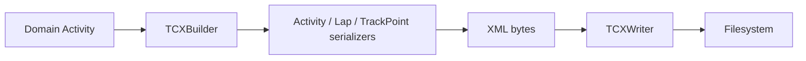

# Serialization architecture

Serialization is deliberately separate from storage:

`TCXBuilder` accepts an `Activity` and returns bytes. It owns no output path.
Its validator reads bundled schema files, then composes injected serializers.
`ActivitySerializer`, `LapSerializer`, and `TrackPointSerializer` each create one
level of the XML tree. `TCXWriter` has the inverse responsibility: it accepts only
bytes and a destination, so it has no domain-model dependency.

`TCXBuilder` validates domain exportability, serializes with lxml, then validates
the generated document against the locally bundled Garmin Training Center v2 and
ActivityExtension v2 schemas. The service writes only successfully validated bytes.

The generic `serialization` package provides `Serializer`, `DocumentBuilder`, and
`DocumentWriter` protocols. Other formats can reuse these contracts while choosing a
filesystem writer, memory stream, zip entry, or cloud implementation independently.
