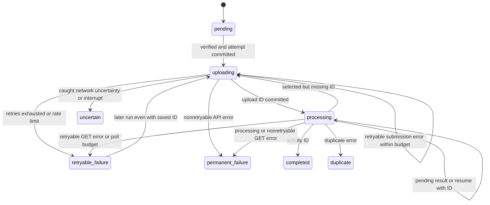
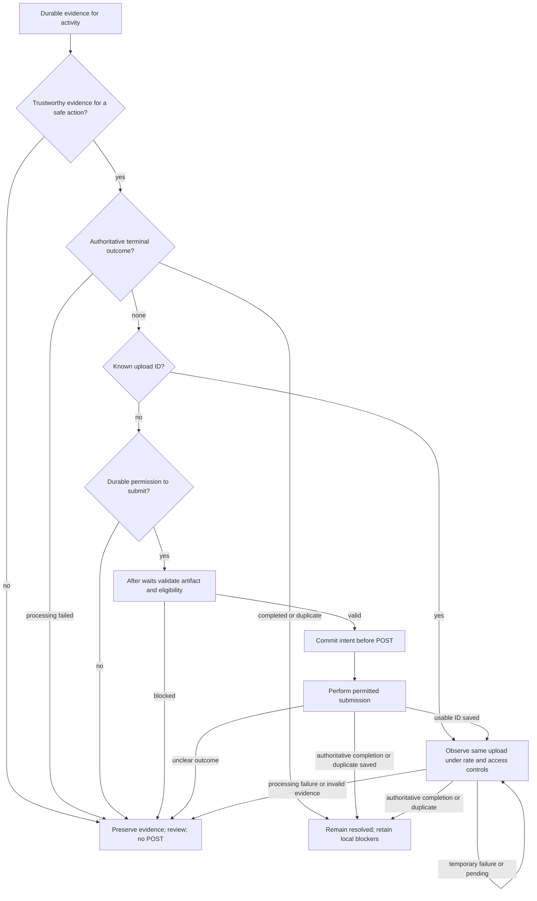

# SPEC-001: Strava Uploader Recovery & Idempotency

Status: Verified
Created: 2026-09-27
Reviewed: 2026-09-27 (Sprint 10.3B human decisions and consistency review)
Human decisions: Incorporated from Sprint 10.3B (2026-09-27)
Approval: 2026-09-27 (requesting user explicitly approved the Reviewed behavioral contract)
Implementation plan: [Approved plan and execution evidence](001-strava-uploader-recovery-plan.md)
Verified: 2026-09-30 (synthetic verification and final compliance review; live acceptance pending)
Supersedes: None
Investigation baseline: `1499448edfd42a32eb166c05306c607b9d6bf1b0`

This is an investigation and human-reviewed behavioral contract under the
[SDD workflow](README.md). **CURRENT** describes the baseline implementation;
**REVIEWED TARGET** preserves the approved behavioral contract. Implementation and
verification evidence are recorded in Completion; CURRENT remains the historical baseline.
The requesting user explicitly approved this contract on 2026-09-27.
SPEC-001 is Verified under the SDD lifecycle; this does not claim live acceptance.

## Problem

The uploader persists remote upload IDs, but recovery dispatch depends primarily on
the status label. A polling error or polling-budget exhaustion can leave
`retryable_failure` with a known upload ID; a later run sends another POST. An
interrupted POST can instead leave `uncertain` or `uploading`, and reset can erase
the evidence that should prevent resubmission. These paths need a precise recovery
contract before changing code.

## Motivation

Migration must preserve training history without creating avoidable duplicates.
Temporary inability to observe an upload must not be confused with evidence that
submission failed. Recovery should be explainable, durable and safe across repeated
runs, including workspaces written by the current version.

## Current behavior

### Evidence and boundaries of the investigation

The following source is authoritative for CURRENT statements at the baseline:

| Source | Investigated responsibilities |
| --- | --- |
| [strava/uploader.py](../strava/uploader.py) | `Uploader.__init__`, `select`, `verify`, `run`, `_submit`, `_poll_once`, `_before_request`, `_handle_status`; `ProcessingJob`, `sanitize_error` |
| [strava/client.py](../strava/client.py) | `StravaClient.upload`, `get_upload`, `_upload_response`, `_check_budget`, `access_token`, `_token_request`; `TokenStore`, `StravaAPIError`, rate-header parsing |
| [strava/state.py](../strava/state.py) | `UploadState`, schema version 1, `UploadStateStore.transaction`, `reconcile`, `set_status`, `reset`, `summary` |
| [strava/models.py](../strava/models.py) | `MigrationManifest.load`, `ManifestActivity.eligible`, `FitInfo`, `UploadStatus.upload_id`, token and rate models |
| [strava/rate_limit.py](../strava/rate_limit.py) | `RateLimitPolicy.before_request`, `DailyLimitReached`, `RateWait` |
| [strava/progress.py](../strava/progress.py) | `ProgressSnapshot`, `snapshot`, `progress_table`, `print_status` |
| [core/cli.py](../core/cli.py) | `strava_upload`, `strava_status`, `strava_reset`, `_state_store`, progress/rate callbacks |
| [services/migration.py](../services/migration.py) | Source-byte identity, `file_sha256`, manifest version and eligibility |
| [tests/test_strava_uploader.py](../tests/test_strava_uploader.py) | Synthetic workspace, `FakeClient`, `FakeClock`, HTTPX mocks; existing selection, persistence, retry, interruption, rate and progress coverage |

Read together with [architecture](../docs/architecture.md#uploader-and-persistence),
[uploader operations](../docs/strava-uploader.md),
[workspace contract](../docs/migration-workspace.md),
[troubleshooting](../docs/troubleshooting.md#upload-state),
[Python guidance](../docs/python-guidelines.md), [testing](../docs/testing.md),
[agent guidance](../AGENTS.md) and [security](../SECURITY.md).

Official API references checked on 2026-09-27, without authenticated requests:

- [Uploads guide](https://developers.strava.com/docs/uploads/): submission and
  processing are asynchronous; polling reports completion and errors, including
  duplicates. A polling interval of at least one second is recommended.
- [Uploads API reference](https://developers.strava.com/docs/reference/#api-Uploads):
  POST creates an upload; GET addresses a known upload ID. `external_id` is described
  as an external identifier, not an idempotency key. No idempotency-key guarantee or
  upload lookup by external ID is documented in the examined upload endpoints.
- [Rate limits](https://developers.strava.com/docs/rate-limits/): overall and read
  limits, natural quarter-hour resets, midnight UTC reset and HTTP 429.

The inference is deliberately limited: this application has no verified remote
idempotency or unknown-upload reconciliation mechanism. This is not proof that every
possible Strava service or support route lacks one. No live upload or account data
was used. Crash behavior below is control-flow/persistence analysis, not a claim of
tested power-loss durability or observed remote duplicate creation.

### Lifecycle and persistence ordering

1. The CLI requires exactly one of `--limit`, `--activity-id`, `--all`; date filters
   are optional. There is no separate resume command. Resume means another upload run.
2. `Uploader` loads manifest version 1, rejects duplicate stable IDs, and reconciles
   SQLite. New rows are `pending`, including ineligible rows. Changed FIT hash or
   eligibility and missing manifest entries become `local_file_changed`, even if
   previously completed. Remote IDs, attempt counts and completion timestamps survive.
3. `select` requires eligibility and a resolved start, then permits only `pending`,
   `retryable_failure`, `processing`. The limit counts the first two; matching
   processing entries are included beyond that limit. An explicit unselectable ID
   raises validation error. Every selected entry, including observation-only work,
   passes `verify`. A validation failure aborts selection rather than just omitting it.
4. `verify` requires valid FIT metadata, a workspace-contained resolved path, a file
   and matching SHA-256. Missing/hash-changed files persist `local_file_changed`.
   Invalid metadata/path raises without that update. FIT size is **not checked**.
5. `run` builds an in-memory polling job only for `processing` plus a truthy stored
   upload ID. Everything else in the selected list enters the submission queue,
   including `retryable_failure` with an ID and `processing` without an ID.
6. `_submit` verifies the file again, once before its entire retry loop. Rate policy
   runs before each attempt. `set_status(uploading, increment_attempt=True)` commits
   before the progress notification and before calling `client.upload`.
7. Inside the client: budget check, token load/possible refresh, then file open and
   multipart POST with `external_id=stable_activity_id`. Thus durable `uploading`
   does not prove that POST began. There is no transaction spanning SQLite and HTTP.
8. The client classifies the response. `_submit` obtains `result.upload_id` and
   commits `processing` plus that ID before a processing notification or any poll.
   It then handles an immediate terminal result in a separate transaction. There
   is a crash window between receiving the ID and committing it.
9. Synchronous GET calls observe queued remote processing. An activity ID completes
   the row. Otherwise an error containing `duplicate` (case-insensitive substring)
   resolves it as duplicate; another error is permanent failure. Without either,
   the textual `status` does not drive a transition and processing continues.
10. Each `set_status` commits independently. Omitted remote IDs are retained using
    `COALESCE`; supplied IDs can overwrite earlier IDs. Error/HTTP fields are replaced
    on each call, including cleared when omitted. No append-only attempt history is
    kept. Completion time is set for completed and otherwise retained.

Dry-run selects/verifies and can create/reconcile state but makes no API call. Its
output says `would_upload` even for selected processing entries. Local `status`
also reconciles state but does not hash files or contact Strava.

### Actual states

The store does not enforce legal transitions or validate every status/ID combination.
IDs in this table describe ordinary paths; inherited IDs can exist in almost any
state because updates retain them. Terminal means no automatic scheduler selection,
not immutable state; only completed and duplicate count as resolved.

| CURRENT state | Entry and meaning | Upload ID | Automatic next run / retry | Terminal or action needed |
| --- | --- | --- | --- | --- |
| `pending` | New reconciled row or explicit reset | Normally none; store can retain one through direct updates | Eligible, verified entries submit | Nonterminal; no action normally |
| `uploading` | Committed attempt intent before client call; also stranded failures/crashes | Normally absent on first attempt; may retain an older ID | Not selected or automatically reclassified | Unresolved/stalled; manual review then current reset |
| `processing` | Accepted POST ID saved; remote outcome not resolved | Normally present; no database constraint requires it | Verify local FIT, then poll if ID exists; otherwise submit | Nonterminal; missing ID is unsafe ambiguity |
| `completed` | Response has activity ID, taking precedence over error | Normally known, plus activity ID | Not selected | Resolved; current reset requires force |
| `duplicate` | Response error contains `duplicate`, without activity ID | Normally known; duplicate activity ID is not parsed from text | Not selected | Resolved; current reset requires force |
| `retryable_failure` | Exhausted retryable submission error, submission rate limit, retryable GET error, poll budget exhausted | May be known, especially after polling | Selected for another POST, even with ID | Nonterminal; unsafe to treat every row as safe submission |
| `permanent_failure` | Nonretryable API error, malformed response, or processing error | Depends on phase; retained if known | Not selected | Unresolved automatic stop; review/reset |
| `local_file_changed` | Missing/hash-changed FIT, changed hash/eligibility, removed manifest entry | Retained if known | Not selected | Unresolved automatic stop; artifact/manifest review |
| `uncertain` | Caught POST timeout/network error or interrupt inside submission try block | Usually absent, but may be retained if interruption occurs after ID persistence | Not selected | Unresolved automatic stop; reconcile/review, never blind reset |
| `skipped` | Defined enum value; no normal scheduler transition produces it | Store permits retained ID | Not selected | Unresolved automatic stop; no normal recovery path |

This shows ordinary scheduler transitions. Reconciliation can move any row to
`local_file_changed`; explicit reset moves any row to pending and clears IDs, with
force required only for completed/duplicate. `skipped` has no scheduler edge.
Hard termination can leave the last committed state without any new edge.

### Confirmed recovery gaps

- GET timeout/network errors, HTTP 5xx and HTTP 429 are retryable. `_poll_once`
  records `retryable_failure`, retains the upload ID and removes the in-memory job.
  Sixty successful still-processing polls (default) do the same with `poll_timeout`.
  On the next selected run `run` puts the row into the POST queue. The earlier
  upload may already have created an activity. Remote duplicate detection may catch
  the extra submission; it is not a verified exactly-once guarantee.
- GET 401/403, other unexpected HTTP responses and malformed responses produce
  `permanent_failure` with the ID retained. They are not automatically selected.
  Neither a GET failure nor a missing remote result proves the earlier POST failed.
- Submission HTTP 5xx is retried up to three client calls by default, sleeping
  one then two seconds. Between attempts state stays `uploading`; each attempt
  increments the counter. No evidence is recorded that the previous POST had no
  remote side effect. The same uncertainty principle applies here, not just to GET.
- POST `httpx.TimeoutException` and `httpx.NetworkError` become `uncertain`, without
  retry. This includes connect failures covered by those types, even if connection
  establishment in fact failed before transmission. Other exceptions, such as
  protocol errors, are not covered by this catch and may strand `uploading`.
- A malformed expected HTTP 201 becomes nonretryable `malformed_response` and hence
  permanent failure, although remote acceptance is possible. A valid model without
  `id`/`id_str` raises `ValueError` when its ID property is read, leaving `uploading`.
  Even an activity ID in that response is not handled before this property access.
- Token load/refresh/scope errors raise `ConfigurationError`; file-open errors can
  raise `OSError`. These occur after the uploading commit but may precede the upload
  POST; they are not converted to a phase-specific uploader state. CLI upload catches
  application errors, not every SQLite, HTTPX, value or filesystem exception.
- `reset` erases upload ID, activity ID and latest error/HTTP fields, sets pending,
  and retains attempts/timestamps/FIT hash. Uncertain, uploading and failed rows do
  not require force. A prior completed row reclassified by reconciliation as
  `local_file_changed` also loses the force guard. Reset never deletes remote data.

### Interruption, scheduling and reporting

Ctrl+C inside `_submit`'s try block writes `uncertain` and rethrows to `run`, which
sets an interruption stop reason. That block includes response processing, so an
interrupt can overwrite `processing` or even a just-written terminal status while
retaining IDs. The uploading commit and initial callback are outside that try block;
an interrupt there, or during retry backoff, can leave `uploading`. During polling,
rate waits and scheduler sleeps, `run` catches the interrupt and retains the last
committed state. This is not a graceful drain of every remote upload. Hard kill,
crash, machine restart and power loss do not run these handlers.

The scheduler is single-threaded with synchronous HTTP, interleaving independent
remote jobs. Default capacity is three; CLI permits one through ten. All selected
processing jobs are restored together, even if their count exceeds a newly lowered
capacity; new submissions wait until capacity permits. A failed poll removes a job
and frees local capacity although the remote upload may still be processing.
An unhandled exception can end the run and leave other rows at their last commits.
There is no cross-process workspace lock; two writers are outside current safety
guarantees and must not be mistaken for this bounded single-process pipeline.

Rate policy checks before each submission/poll; reads additionally use read limits.
Short-window reserve waits to the next quarter-hour plus one second; daily reserve
stops before that request. After a wait the observed snapshot is cleared. HTTP 429
stops the run; other processing rows retain their IDs. The client's own exhausted
budget check occurs before POST/GET and raises `rate_limit` without HTTP status;
submission special-cases it as retryable, polling uses its default nonretryable flag.
OAuth refresh is inside the client call, not a separately scheduled upload request.

Newly submitted jobs begin polling after at least one second (default two); resumed
processing jobs are immediately due for their first GET, subject to rate policy.
Subsequent intervals double to thirty seconds. The budget counts successful
still-processing polls, not all attempts. Restart rebuilds poll count/backoff in
memory. A transient polling error ends this job for this run, rather than using
the submission retry loop.

Progress counts completed plus duplicate as resolved. `needs_attention` counts
permanent failure, changed file and uncertain, but not stranded uploading or unsafe
retryable rows. `status --details` shows aggregate state counts, not per-activity
remote IDs, failure phase or recovery actions. A run can print a general safe-resume
message despite these distinctions. These are observable gaps, not new CLI behavior.

## Intended behavior

**REVIEWED TARGET**, selected by the human decisions in Sprint 10.3B and explicitly
approved on 2026-09-27. Implementation evidence is recorded in Completion; CURRENT
findings above are unchanged.

**Central invariant:** Never create a new Strava upload while there is evidence that
an upload may already exist for that migration activity.

**Positive submission rule:** A new upload may be created only when durable evidence
positively establishes that submission is permitted. A retry requires positive
evidence that the failed attempt did not and could not create a remote upload, and
that no older unresolved submission attempt exists. A genuinely fresh activity can
be a safe candidate under the intact-state assumptions below. Eligibility, artifact
integrity and rate controls must also pass before any actual POST.

No evidence of success is not evidence of non-submission. Missing IDs, retryable
labels, timeout/connection loss, HTTP 5xx, malformed success, interrupted submission
or failure to observe an upload never grant retry permission. A rejection such as
429/4xx alone does not prove absence of side effects. Unless request-phase and API
evidence positively prove non-submission, record review-only uncertainty. The
examined API contract does not establish a blanket status-code retry allowlist;
SPEC-001 grants none. Proven local/pre-transmission failures can be corrected and
retried without overriding an older unresolved attempt.

Submission creates an upload with POST. Observation uses GET on a known upload ID.
Failed observation may lead to another GET or review, never a new POST. Authoritative
processing failure is review-only and retains the failed ID. Uncertain no-ID
submission remains blocked; SPEC-001 adds no remote search, reconciliation endpoint,
scope or heuristic, and no force-resend feature.

The contract is duplicate-resistant automatic behavior and safe resume in an intact
workspace used by one uploader process. It does not promise exactly-once delivery,
completion, cross-workspace deduplication or recovery of lost/corrupt history.

| Situation | CURRENT | REVIEWED TARGET |
| --- | --- | --- |
| Poll failure with ID | Retryable label can lead to POST | Preserve ID; retry observation or review |
| Stranded uploading | Ignored until reset | Ambiguous; review without POST unless stronger positive evidence exists |
| Malformed POST success / missing ID | Permanent failure or uncaught error | Preserve evidence; observe a trustworthy known ID or review; no POST |
| POST 5xx | Bounded repeated POST | Review; code alone does not prove safe retry |
| Known ID plus local FIT/manifest problem | Selection can block GET | GET remains possible; local blocker independently blocks POST |
| Reset | Clears remote IDs | Recover safest valid action; retain evidence; no force-resend |
| Completed/duplicate plus local change | Reconciliation replaces status label | Preserve remote resolution and separately visible local blocker |

## Scope

Submission safety, observation recovery, restart/resume, durable per-activity evidence,
retry classification, uncertainty, duplicate-safe automatic behavior, reset safety,
versioned state upgrade, legacy compatibility and user-visible recovery actions.

## Non-goals

Polar parsing, domain redesign, FIT/TCX generation, audit eligibility, manifest or
stable identity redesign, duplicate source-byte identity repair, lap boundaries,
OAuth redesign, token encryption/storage redesign, workspace locking, GUI, CI,
dependency cleanup, general performance work, rate-limit redesign and API expansion.
Remote activity search, automatic uncertain-upload reconciliation, force resend and
exactly-once guarantees are explicitly excluded. No remote deletion is introduced.

## Terminology

| Concept | Meaning; not a prescribed enum or database column |
| --- | --- |
| Submission | POST creating a remote upload, distinct from the eventual activity |
| Observation | GET of a known upload; retry does not create a new upload |
| Safe submission candidate | Durable evidence permits a new attempt, subject to eligibility, integrity, rate and blocker checks |
| Submission intent | Durable barrier before a potentially side-effecting POST; after interruption it is not proof that POST happened or did not happen |
| Confirmed submission | A trustworthy upload ID is known; observation may be pending, failed or terminal |
| Uncertain submission | Acceptance may have occurred without an authoritative usable result; review-only unless a trustworthy known ID permits observation |
| Authoritative processing failure | A known remote upload failed processing; retain its evidence and require review, never automatically POST again |
| Resolved | Authoritative completion or duplicate; not local suspicion or an inferred match |
| Recovery evidence | IDs, attempt safety/phase, outcomes and history required to prevent unsafe resubmission |
| Review-only | No automatic submission permission; repair can restore a permitted observation, but acknowledgment cannot erase uncertainty |

## Architecture impact

The prepared manifest/FIT boundary remains. The uploader orchestrates recovery; the
client reports HTTP/response evidence; the state store durably preserves that evidence;
CLI/progress expose the resulting permitted actions. The reviewed target requires
a versioned state representation because one status cannot safely express all three
dimensions below. It does not prescribe columns, SQL, classes or exception types.

Architecture consistency review confirms:

- Polar parsing and FIT generation stay outside the uploader.
- Audit/workspace owns source interpretation and migration eligibility; the Strava
  client does not redefine them. Observing old IDs does not make entries eligible.
- Domain models remain independent of Strava and persistence.
- Recovery decisions do not depend on CLI text/layout. Progress callbacks remain
  reusable by future UI/API consumers.
- Rate controls apply to both operations; source integrity, durable evidence and
  privacy safeguards remain boundaries of the implementation.

This identifies expected changes within the uploader/client/state/progress boundary,
not an implementation plan. Current architecture documentation remains descriptive
of current code until implementation changes it.

## Data and state impact

CURRENT schema 1 stores a single row per stable activity ID with manifest version,
FIT hash, eligibility/presence, state, upload/activity IDs, attempt counters/times
and latest HTTP/error fields. It stores no FIT path/size or complete attempt ledger.
SQLite commits do not make local storage and Strava one atomic transaction.

The REVIEWED TARGET requires a versioned schema migration or equivalent versioned
upgrade mechanism, preserving three conceptually independent durable dimensions:

| Dimension | Information that must remain distinguishable |
| --- | --- |
| Submission safety/evidence | Safe candidate, attempt intent, uncertainty or confirmed submission; relevant earlier attempts and why POST is or is not permitted |
| Remote observation/outcome | Not started, processing, observation deferred, processing failed, completed or duplicate; known IDs and supporting result evidence |
| Local blockers/review conditions | Artifact/manifest problems, authorization required, malformed/conflicting state and other review reasons; conditions may coexist with remote outcomes |

For example, confirmed submission plus remote processing plus an artifact-change
blocker permits GET of the known upload and prohibits POST. A terminal remote result
does not clear the artifact blocker. No example name mandates an enum or schema field.

Persist intent before a permitted POST, and known IDs before polling. If intent
persistence fails, do not POST. If response persistence fails, stop affected work;
the prior intent barrier remains and restart must inspect committed evidence rather
than assume a fresh attempt. Errors, artifact reconciliation, reset and callbacks
must not erase stronger prior evidence. A failed/partial upgrade must not leave a
usable-looking clean pending state or authorize network work from unvalidated state.

Preserve enough history to explain permitted actions; do not invent missing legacy
history. Unsupported versions fail closed without destructive downgrade or database
recreation. The existing version-1 reader already rejects a different schema version;
future upgrade/versioning must retain that protection. Exact version, representation,
transaction boundaries and migration mechanics belong to the later implementation
plan. Source/domain/manifest schemas remain unchanged.

## Detailed behavior

### Recovery routing

GET retries are bounded and rate-controlled; the self-edge includes later runs, not
an infinite loop. Artifact/eligibility/manifest blockers do not block GET, but access
failures, unusable/conflicting identity or malformed recovery state may require
review before a trustworthy GET can be made. Independent valid known-ID evidence
can still permit observation when other evidence is ambiguous; no branch permits
POST from uncertainty or known submission.

Resume observes processing or deferred observation with a known ID. Observation
errors preserve that operation identity across restart, including rate stops and
poll-budget exhaustion. Processing-failed rows remain review-only; retry policy for
those failures would require a future specification. Completed and duplicate stay
resolved even if local files change. No-ID uncertainty stays blocked; changed
authentication, missing search results or elapsed time cannot establish absence.

Observation candidates come from durable remote evidence, including entries removed
from or made ineligible by the manifest. Local FIT validation is not a prerequisite
for GET. Retained remote terminal evidence must be persisted even for absent entries,
and local problems remain separately visible. Normal activity/date selectors continue
to scope work; retained identity/time metadata is used for removed entries. If a date
filter cannot be evaluated reliably, report that row for explicit-ID or `--all`
recovery rather than guess. `--limit` limits new submission candidates, not matching
known-ID observation. These rules preserve current selector concepts while preventing
the eligibility gate from hiding old uploads. No new API or broad CLI redesign follows.

### Authoritative response evidence

A valid remote activity ID in an attributable, internally consistent Strava upload
response is completion evidence. A trustworthy upload ID must be retained whenever
obtained, including when other fields are unusable. Never overwrite an already known
ID with a contradictory ID or equate a missing ID with permission to POST. IDs must
be valid positive remote identifiers; conflicting `id`/`id_str`, a mismatch with the
polled upload, malformed required fields or contradictory success/error information
preserve evidence and route to safe observation/review, not manufactured completion.
A textual status without authoritative outcome evidence cannot complete an activity.

For a well-formed success response with a valid activity ID and no contradictory
evidence, completion remains authoritative even if an upload ID is unavailable;
preserve the activity ID and any separately obtained upload ID. Missing an ID needed
to correlate a GET response, malformed success, or conflicting evidence instead
requires review. This distinction avoids both inventing success and discarding a
valid terminal outcome merely because an observation ID was absent.

The official [upload error example](https://developers.strava.com/docs/uploads/#errors)
uses human-readable error text naming a file and identifying the duplicated activity;
no structured duplicate code is documented. The reviewed recognition contract is
therefore deliberately narrow: an attributable upload response with consistent
upload identity, no contradictory completion evidence, a processing-error status,
and a complete error message of the documented form
`<file name> duplicate of activity <positive activity ID>` may resolve as duplicate.
Recognize the complete assertion, not the word `duplicate` anywhere in arbitrary
text. Documented HTML escaping/markup may be normalized as presentation without
fuzzy matching or inventing missing content. Negations, incomplete messages, unknown
variants, malformed IDs and conflicting fields go to review. Preserve the duplicate
evidence and known IDs. This is a conservative application recognition rule based
on the documented example, not a promised machine-readable Strava error schema.
Service wording changes may require review instead of automatic resolution.

### Reset behavior

Reset recovers the safest valid local workflow; it does not delete history. The
existing `--force` must not bypass this contract. No acknowledgment, flag or generic
force-resend override may authorize a POST that lacks positive safety evidence.

| Evidence category | Allowed reset/recovery result | Evidence and restrictions retained |
| --- | --- | --- |
| Proven pre-submission failure, no older unresolved attempt | Safe candidate after correcting cause and rechecking gates | Preserve why non-submission was proven and attempt history |
| Known ID with processing/deferred observation | Return toward observation; access or evidence issues may still require review | Preserve upload ID and prior evidence; no POST |
| Known ID with authoritative processing failure | Remain review-only | Preserve failed ID/result; no retry submission |
| Uncertain submission without ID | Remain blocked/review | Preserve uncertainty; no force-resend or new reconciliation |
| Uncertain label with trustworthy ID | Permit observation/review using that ID | Preserve any uncertainty about other attempts; no POST |
| Completed | Remain resolved | Activity/upload IDs and terminal evidence protected |
| Authoritative duplicate | Remain resolved | Duplicate evidence and known IDs protected |
| Artifact/manifest blocker | Clear only the corrected local condition; recompute permitted action | Remote evidence is independent; correction alone does not establish submission safety |
| Malformed/conflicting state or ambiguous legacy history | Remain blocked until evidence is safe to interpret | No guessed history, clean-state recreation or automatic POST |

## Error and recovery behavior

The table defines the REVIEWED TARGET. CURRENT literal-state behavior remains in the
investigation above. Permission applies per activity and across all its attempts;
older unresolved evidence overrides a safe-looking latest failure. "Observe" always
means a trustworthy known ID, rate/access controls and bounded work. A local blocker
may coexist with processing or resolution and is never cleared just by remote success.

| Phase / failure | Remote may exist / ID | POST permission | GET permission | Durable classification/blocker | Automatic next action / human action |
| --- | --- | --- | --- | --- | --- |
| Preflight missing/hash-changed/invalid FIT, unsafe path or local read error | Not from this attempt; prior remote evidence possible | No until corrected; then only positive safety evidence permits | Yes if trustworthy ID exists, independent of FIT | Artifact blocker plus unchanged remote/evidence dimensions | Block submission; observe existing ID where applicable; human corrects artifact |
| Configuration/OAuth failure proven before upload POST | No new upload from this attempt; prior ID possible | Only after cause corrected and no older unresolved attempt | After authorization/access repaired, if ID known | Proven pre-submission failure or observation access blocker, preserving prior evidence | Report repair needed; human repairs configuration/access |
| Policy short-window reserve before request | No new effect; prior ID retained | Defer permitted POST, then fresh validation | Defer permitted GET | Operation and evidence retained | Wait to natural window under policy; no reset needed |
| Policy daily reserve or client budget rejection before network | No new effect; prior ID retained | Only already-proven permission after budget allows | Permitted later for known ID | Deferred operation; no loss of evidence | Daily stop or policy wait; user resumes at permitted time |
| POST HTTP 429 / other 4xx rejection | Cannot infer absence from code; usually no new ID | No from code alone | If trustworthy ID retained | Review unless positive phase/API proof establishes non-submission; authorization blocker where relevant | 429 stops scheduling; preserve evidence, request cause-specific review/repair |
| Connection failure provably before transmission | No new effect if positively established; prior ID possible | Yes after correction only without older unresolved attempt | If known ID, recover by GET instead | Proven non-submission, or uncertainty when proof absent | Retry only permitted operation after gates; review if not provable |
| POST timeout/loss/transport ambiguity or generic protocol error | Yes; ID may be unavailable | No | Only with independently trustworthy ID | Submission uncertainty plus review condition | No-ID outcome stops for review; no remote search or force resend |
| POST 5xx | Yes cannot be excluded; usually no ID | No from 5xx or retryable label | If trustworthy ID exists | Uncertainty/review; preserve earlier evidence | Do not repeat POST; human review |
| POST success malformed / missing usable evidence | Yes; ID absent, invalid or partially usable | No | Only trustworthy retained ID | Preserve obtained IDs and ambiguity; no inferred completion | Observe where safe, otherwise review; valid unambiguous activity-ID completion follows response rules |
| POST accepted with usable ID | Yes / known | No | Yes | Confirmed submission, remote processing/result | Commit ID, then observe or persist authoritative terminal outcome |
| GET timeout/network/5xx | Yes / known | No | Yes, bounded retry now or later | Observation deferred, ID retained | Retry observation under rate policy; report deferral if run ends |
| GET HTTP 429 | Yes / known | No | Later under rate policy | Observation deferred, ID retained | Stop scheduling; user resumes later; never POST |
| GET 401/403, 404, other permanent access/retrieval error | Yes / known | No | Only when access/evidence allows a meaningful GET | Review/access blocker and remote evidence retained | Explain cause; human repairs/reviews; absence/unavailability proves nothing about POST |
| GET malformed/conflicting response | Yes / original ID retained | No | Same trustworthy ID may be reobserved; never substitute conflicting ID | Review/deferred observation; preserve conflicting evidence safely | Bounded safe observation or review; no fabricated terminal outcome |
| Pending processing / poll budget exhausted | Yes / known | No | Yes later, bounded | Processing / observation deferred | Preserve ID and defer to later resume |
| Authoritative processing failure | Upload exists / known | No | No automatic polling needed for the failed terminal upload | Processing failed and review-only; failed ID retained | Require review; resubmission policy is future work |
| Authoritative completed activity | Yes / activity ID, upload ID if known | No | No further observation needed | Resolved plus any independent local blocker | Preserve terminal result; no action unless local issue needs review |
| Conservatively recognized authoritative duplicate | Existing activity / known upload evidence | No | No further observation needed | Resolved duplicate plus any independent local blocker | Preserve evidence; local duplicate suspicion alone cannot resolve |
| Interruption or persistence failure | Depends on boundary / maybe | Only positive committed safety evidence can permit | If trustworthy ID committed | Last committed evidence, intent/uncertainty or remote outcome | Follow crash matrix; no handler-dependent resend permission |
| Local artifact/manifest changes after confirmed submission | Yes / known | No | Yes despite missing/changed/ineligible/removed artifact | Remote state plus independent artifact/manifest blocker | Observe and persist terminal evidence; human separately repairs/reviews local issue |
| Malformed/unknown persisted state or unsupported version | Cannot safely infer / untrusted | No | Only independently validated known-ID evidence permits | Review; no destructive repair | Safe diagnostic, block affected work; human review/compatible upgrade |

## Crash/restart analysis

Assumptions: the same intact workspace, one uploader process and no external history
deletion/rewriting. Commit means the transaction returned successfully; storage loss
or corruption exceeds that guarantee. The target must work without cleanup handlers
after hard termination. Graceful Ctrl+C stops scheduling and preserves evidence; it
does not need to drain all remote jobs to establish safety.

| Interruption boundary | CURRENT persisted behavior | Ambiguity / duplicate risk | REVIEWED TARGET recovery |
| --- | --- | --- | --- |
| 1. Before durable pre-upload state | Prior row; pending/retryable can submit, processing+ID polls | Fresh row may be safe; retryable label may hide prior submission | Reinspect committed history; POST only with positive permission, otherwise GET/review |
| 2. Intent committed, before POST | `uploading`, normally no ID, not selected | POST did not occur at this exact point, but restart cannot distinguish it from points 3-5 | Review unless stronger durable evidence positively proves no transmission; no assumed retry |
| 3. POST being sent | Hard kill leaves uploading; caught in-try Ctrl+C writes uncertain | Acceptance unknown | Preserve uncertainty; no new POST; observe only a trustworthy saved ID |
| 4. Remote received POST, response not handled | Same as point 3 | Upload may complete without local ID | No-ID review; no reconciliation/heuristic or override |
| 5. ID received, not durably saved | Uploading or an older retained ID | Volatile ID lost, possibly another upload exists | Review unknown attempt; retained trustworthy ID can be observed without clearing other uncertainty |
| 6. ID saved | Processing+ID, normally GET after FIT verification; in-try interrupt can relabel uncertain | Label may understate saved evidence | Observe same ID independently of artifact problems; retain uncertainty about any other attempt |
| 7. During polling | Last committed processing or handled retryable/permanent failure with ID | Retryable label currently allows re-POST | Retry/defer GET or review according to cause; no POST |
| 8. Terminal response received, terminal commit incomplete | Prior processing+ID normally reobserves | Remote result may already be terminal | Reobserve same ID; if unavailable review, never POST; if terminal evidence actually committed keep it |

After committed completion/duplicate, remain resolved and retain local blockers.
After committed processing failure, remain review-only. If commit outcome is unknown,
inspect the reopened store; never presume the write failed and recreate pending.
No local transaction can remove the remote-acceptance/local-ID gap. SPEC-001 accepts
conservative blocking in that gap instead of claiming exactly-once behavior.

## Data integrity

Identity remains `sha256:` plus exact source bytes. The manifest supplies relative
FIT path, expected SHA-256, optional size and eligibility; state joins by stable ID.
FIT hash is distinct from source identity. Byte-identical source files at multiple
paths produce duplicate manifest IDs that the current uploader rejects; source edits
change identity. These remain related future work, not recovery identity redesign.

CURRENT verifies SHA-256 at selection and once before the entire submission retry
loop; size is progress metadata, not an enforced validation gate. There is no locked
snapshot. Path/size-only changes do not trigger hash/eligibility reconciliation.

REVIEWED TARGET: validate workspace containment/path safety, eligibility and expected
SHA-256 immediately before each actual permitted POST attempt, after relevant rate
waits, retry delays and other pre-submission work. Waiting must not let stale
validation authorize different bytes later. Size may assist consistency checks but
must not replace SHA-256. Validation failure blocks the POST and remains visible.
Correction clears only the relevant local blocker, never submission history.

This is the strongest practical validation-boundary requirement, not a claim of
race-free filesystem access under concurrent external modification. No general
workspace locking is introduced. The later plan may choose an immutable snapshot
or another mechanism if needed to reliably tie verified bytes to a submission.
Observation transmits no FIT and requires no FIT validation. Manifest absence or
ineligibility blocks new submission, not GET of an already known upload.

## Security and privacy

Recovery must not put tokens, secrets or raw private HTTP/OAuth payloads into SQLite,
manifests, logs or user-facing diagnostics. IDs, timestamps and error details remain
private migration metadata; retain only the safe evidence needed for recovery.
HTML stripping/truncation alone is not secret redaction. Synthetic fixtures must
verify both evidence retention and redaction.

Token repair/refresh preserves remote evidence. Changed authentication or athlete
context does not establish absence or permit POST. If access/identity is uncertain,
retain evidence and show a review/access block; do not add account-search endpoints,
scopes or automatic reconciliation. OAuth/account-binding and storage redesign are
outside scope. Follow [SECURITY.md](../SECURITY.md); no live migrations are validation.

## Compatibility

Introduce a versioned upgrade capable of representing the independent dimensions.
Preserve legacy evidence and record conservative interpretations without inventing
lost history. Exact SQL/version and migration mechanics are later plan work. Legacy
`uploading` can mean intent, no transmission, in-flight POST, remote acceptance or
an unsaved response ID. By itself it proves neither submission nor non-submission.

The mapping below assumes structurally valid rows. Trustworthy retained terminal
evidence takes precedence over a nonterminal label, while contradictions require
review with evidence preserved. A trustworthy ID can permit observation even when
other history remains uncertain; that does not resolve unknown additional attempts.

| Schema-1 row/evidence | Reviewed classification/action | POST permission |
| --- | --- | --- |
| Pending, zero attempts, no remote/contradictory evidence | Safe candidate under intact-state assumptions; apply all gates | Candidate only, never bypass validation/rate policy |
| Pending with attempt history | Blocked/review: reset may have erased IDs/phase; observe any trustworthy retained ID | None without positive evidence; attempt count is not proof of non-submission |
| Uploading without ID | Ambiguous intent/transmission; review | No |
| Uploading with ID | Preserve ID and observe/review; retain ambiguity about later attempts | No |
| Processing with ID | Observe same upload independently of local artifact problems | No |
| Processing without ID | Malformed/insufficient recovery evidence; review | No |
| Retryable failure with ID | Observe/review, preserving prior attempts | No from label |
| Retryable failure without ID | Blocked/review; especially prior attempts may include accepted 5xx | No from absent ID or retryable label |
| Uncertain with ID | Observe/review trustworthy ID; retain any other uncertainty | No |
| Uncertain without ID | Blocked/review, no remote reconciliation | No |
| Permanent failure with ID | Preserve evidence; authoritative processing error remains review-only; retrieval/access failures may recover observation after repair | No |
| Permanent failure without ID | Review; malformed POST success may conceal acceptance | No without independent positive proof |
| Completed | Preserve valid recorded completion, IDs and terminal evidence; separately expose local issues | No |
| Duplicate | Preserve recorded duplicate resolution and evidence; do not erase legacy resolution merely because the old recognizer was broader | No |
| Local-file-changed with retained remote evidence | Remote completion/duplicate stays resolved where evidenced; processing ID may be observed; independent local blocker remains | No |
| Local-file-changed without remote evidence | Correctable local blocker plus review of submission history; absent ID alone proves nothing | Only if independently proven safe after correction |
| Skipped | Preserve state/evidence; no invented submission history or automatic reset | No automatic permission |
| Unknown/malformed state or incompatible/corrupt database | Block affected work, preserve readable evidence, report review; no recreate-as-pending | No |

A completion timestamp/activity ID retained behind another label must not be erased;
contradictory or insufficient provenance goes to review, not guessed completion.
Schema 1 can have irrecoverably erased reset history and overwritten IDs. Missing,
deleted, restored-stale or externally edited databases cannot be made safe by
inventing history. The contract assumes intact history; it does not claim to detect
every stale restore. Unsupported/newer versions must be refused by older readers,
not silently downgraded. Reopening an interrupted upgrade must safely resume or
refuse; no partial interpretation grants POST permission.

Manifest identity/schema remain unchanged. Reset semantics and recovery reporting
are intentional future compatibility changes requiring user documentation when
implemented. This sprint performs no migration or repair.

## Observability

Existing CLI/status/progress must distinguish these actions/outcomes:

| Category | Meaning |
| --- | --- |
| Ready to submit | Positive evidence permits a new POST, subject to current validation and rate gates |
| Observing | Known upload is being observed or awaits permitted later observation |
| Needs review / blocked | Automatic submission is unsafe or a required condition needs attention |
| Resolved | Authoritative completion or duplicate |

Local blockers are independent: observing plus artifact changed and resolved plus
artifact changed must be expressible. Resolution counts reflect remote outcomes;
review counts may overlap them for local issues. Ambiguous legacy uploading and
unsafe retryable rows count as needing review, not ready work. Removed/ineligible
entries with retained remote evidence remain visible in recovery reporting; they
must not silently inflate the current manifest's eligible denominator or disappear
from review. Layout/grouping is a plan detail, not permission to hide them.

Show an understandable reason and safest allowed next action for affected activities.
Dry-run distinguishes `would_submit` from `would_observe`, lists relevant blocks,
and never contacts Strava. Status remains network-free; local state reconciliation
or upgrade does not imply a network check or current remote outcome. Presentation
must not imply that reset, elapsed time or failed GET makes POST safe. Keep aggregate
progress and reusable callbacks without exposing secrets or internal schema detail.

## Edge cases

- Late Ctrl+C, callback exceptions, local changes or new errors must not overwrite
  confirmed IDs or terminal evidence into apparent submission permission.
- An old known ID plus an ambiguous later attempt permits safe observation of that
  ID while retaining the extra uncertainty; resolving one upload does not fabricate
  the history of another. No new POST is permitted.
- Auth changes, 404 and absent remote search results are not proof of non-submission.
  No search or automatic uncertain-upload reconciliation is added.
- Manifest disappearance/ineligibility and changed FIT never prevent a trustworthy
  known-ID GET; authoritative results and local problems are persisted separately.
- A malformed row or local failure must not make another activity unsafe. Stopping
  the run is acceptable when evidence cannot be maintained.
- Restart above a lowered in-flight capacity retains every known ID; observing them
  and limiting new submissions must not turn old uploads into new POSTs.
- Unknown duplicate wording, invalid/mismatched IDs, or conflicting completion/error
  fields preserve evidence and route to safe observation/review under response rules.
- A processing-failed upload cannot become a fresh submission through reset,
  reauthorization, artifact replacement or a generic force flag.

## Acceptance criteria

All 18 existing IDs and their approved contracts are retained unchanged. Per-criterion
compliance evidence is recorded in Completion; no criterion depends on an unresolved review question.

- **AC-01:** A trustworthy known upload ID routes recovery to the same upload's
  observation or review, never a new POST because its label or observation failed.
- **AC-02:** Poll network/HTTP failures, pending results and poll-budget exhaustion
  preserve ID and observation evidence across restart; only GET may be retried.
- **AC-03:** Possible acceptance without usable authoritative outcome, including
  timeout/loss, 5xx, malformed success or interrupted submission, blocks new POST.
  Without a trustworthy known ID it remains review-only, with no remote reconciliation.
- **AC-04:** Every new POST requires durable positive submission permission, no older
  unresolved submission, and all gates. Proven pre-transmission failure can retry
  after correction; missing IDs, retryable labels and 429/4xx/5xx alone cannot permit it.
- **AC-05:** Authoritative completion remains resolved and prevents automatic POST
  across resume, reset, reconciliation and artifact changes; local blockers remain visible.
- **AC-06:** Authoritative duplicates recognized by the conservative response contract
  remain resolved with evidence retained; local suspicion or an arbitrary `duplicate`
  substring cannot resolve a new outcome. Valid recorded legacy resolution is preserved.
- **AC-07:** Each permitted POST revalidates path safety, eligibility and authoritative
  SHA-256 immediately before the attempt after relevant delays. Artifact/manifest
  problems block POST but not known-ID GET; terminal results and local blockers coexist.
- **AC-08:** All eight crash boundaries produce deterministic safe recovery from
  committed evidence: proven-safe candidate, same-ID observation, resolution or review.
- **AC-09:** Intent persistence failure prevents POST; obtained trustworthy IDs are
  saved before polling. Response-persistence failure never becomes a fresh attempt
  on restart; stronger earlier evidence survives subsequent errors.
- **AC-10:** Concurrent remote jobs retain independent durable evidence; a failure,
  rate stop, lowered capacity or interruption cannot cause another activity's unsafe POST.
- **AC-11:** Recovery respects overall/read limits, reserves, short waits, daily
  stops, HTTP 429 stops and bounded polling; retries bypass none of these controls.
- **AC-12:** Graceful interruption stops scheduling and preserves evidence; hard
  termination safety relies on committed state, not cleanup handlers or assumed failure.
- **AC-13:** Reset preserves all duplicate-prevention evidence and returns only the
  safest valid action from the reset matrix. No force-resend/risk-acceptance override
  is offered, including through the existing force option.
- **AC-14:** A versioned state upgrade preserves independent submission, remote and
  blocker evidence and applies the conservative schema-1 mapping. It invents no
  history, safely handles interrupted upgrade and refuses unsupported/downgrade use.
- **AC-15:** Malformed state/response, missing necessary IDs and conflicting identity
  or outcome fields cannot manufacture resolution, erase known IDs or authorize POST;
  preserve evidence and allow only trustworthy observation or review.
- **AC-16:** CLI/progress/status expose ready, observing, blocked/review and resolved,
  with independent local blockers and visible orphaned/ambiguous recovery work.
  Dry-run distinguishes submission from observation; status/dry-run make no network calls.
- **AC-17:** Diagnostics and durable recovery evidence exclude credentials and raw
  private payloads. Authentication repair/context changes preserve evidence and do
  not establish non-submission or authorize a new POST.
- **AC-18:** Authoritative processing failure retains the upload ID and failed result
  and remains review-only. Automatic resubmission policy for such failures is excluded.

## Verification

The following is the original approved verification plan and investigation-baseline
assessment. Its requirements are unchanged; executed evidence is in Completion.

Future tests use synthetic workspaces, reopened SQLite stores, fake clocks, injected
interruption/persistence failures and mocked HTTP. Verify POST/GET counts and target
IDs as well as user-visible actions and retained evidence; final labels alone can
hide duplicate submission. No new tests or live uploads are part of this sprint.

| Criteria | Required future verification evidence |
| --- | --- |
| AC-01, AC-02 | GET network/5xx/429/auth/malformed failures and poll exhaustion; reopen and resume; unchanged POST count, retained ID and only permitted GETs |
| AC-03, AC-04 | Proven pre-transmission failure then repair produces exactly the permitted POST; timeout, 5xx, malformed success, missing ID and code-only rejection do not. Include older unresolved attempts overriding safe latest failures; zero new POST after uncertain restart |
| AC-05, AC-06 | Completion/duplicate followed by reset, changed/removed/ineligible entry and restart; preserve resolution and no POST. Test documented full duplicate assertion, negation, incomplete/unknown text, local suspicion and contradictory fields |
| AC-07 | Missing/hash-changed/unsafe-path artifacts and mutation during waits/retries cause fresh validation and blocked POST; size cannot replace hash. Known ID plus missing/changed/ineligible/removed FIT permits GET, persists terminal result and retains local blocker |
| AC-08, AC-09 | Inject all eight interruption windows and failed commits; reopen, assert durable evidence and exact operations. Intent-write failure means zero POST; lost response save does not authorize resend. Mocks do not prove power-loss durability |
| AC-10, AC-12 | Mixed batches; Ctrl+C during POST/GET/wait/callback and simulated abrupt exit; restart at lower capacity, verifying each row and no cross-activity resubmission |
| AC-11 | Fake-clock overall/read reserves, natural quarter-hour wait, daily stop, 429 and bounded pending polls; permitted operation identity and IDs survive each stop |
| AC-13 | Every reset-matrix category, including existing force option; compare evidence before/after and after reopen, verify permitted action and zero unsafe POST |
| AC-14, AC-15 | Every legacy mapping row through versioned upgrade/reopen, partial-upgrade failure, unsupported version, unknown state and invalid/conflicting IDs; no invented history or clean-pending repair. Retained-ID legacy retryable rows observe/review; no-ID uploading reviews; both have zero POST |
| AC-16 | Local CLI/callback snapshots for combined remote/local conditions, absent entries, ambiguous legacy states and date/limit selection; verify review/resolution counts, reasons, would_submit/would_observe and zero status/dry-run network calls |
| AC-17 | Synthetic credential markers in auth/HTTP failures and recovery reports; no leakage; auth repair/context ambiguity retains IDs and blocks unsafe POST |
| AC-18 | Processing failure versus transient GET failure; failed upload remains review-only through reset/restart, retains evidence and sends zero additional POSTs |

Existing tests verify portions of CURRENT behavior, including known-processing resume,
uncertain-client-error handling, bounded POST retries, integrity checks and rate
policy. `test_retry_is_bounded` expects repeated POSTs for 503; that is evidence of
current behavior, not the reviewed target. The current interruption test does not
cover all crash windows. Passing the existing suite does not establish these ACs.
After approved implementation, record per-AC evidence and run all
[required checks](../docs/testing.md#setup-and-required-checks), followed by a separate
specification compliance review. One test per criterion is not required.

## Implementation notes

The [approved implementation plan](001-strava-uploader-recovery-plan.md) records the versioned
representation, migration mechanics, APIs/classes, bounded retry scheduling and
artifact-validation mechanism needed for this contract. It must preserve the three
evidence dimensions rather than weaken the contract to fit schema 1. Exact SQL,
column/enum names, safe diagnostic layout and code sequencing are implementation
choices. Any discovered inability to meet a behavioral requirement must return to
specification review; it does not authorize silent reinterpretation.

## Open questions

None. Human review resolved Q1-Q9 through the Sprint 10.3B decisions recorded below.
No approval-blocking behavioral question remains. Technical representation and
migration mechanics are recorded in the approved implementation plan. The next phase
is separately authorized controlled live acceptance.

## Decision log

- 2026-09-27: Sprint 10.3A produced the Draft investigation at the baseline above,
  with no implementation or approval. Its current-behavior findings remain unchanged.
- 2026-09-27: The requesting user's Sprint 10.3B human-review brief resolved Q1-Q9.
  These decisions select the reviewed target; they do not mark this revision Approved.

| Decision | Human-reviewed resolution |
| --- | --- |
| Q1 | Positive proof of safe non-submission plus no older unresolved attempt is required for retry. Absence of success/ID and HTTP status alone do not permit POST; uncertain cases require review. |
| Q2 | Authoritative processing failure retains its ID/evidence and is review-only; automatic resubmission policy is future work. |
| Q3 | Reset preserves history and recovers the safest valid action. No force-resend or risk-acceptance override is part of SPEC-001. |
| Q4 | Known-ID observation continues independently of missing/changed/ineligible/removed artifacts. Persist terminal evidence and retain local blockers separately. |
| Q5 | Introduce a versioned state upgrade representing submission evidence, remote outcomes and local blockers independently; conservatively map legacy rows without invented history. |
| Q6 | No remote reconciliation for uncertain no-ID submissions. No new endpoints/scopes/search/heuristics; changed authentication or absent results do not prove absence. |
| Q7 | Revalidate path/eligibility/SHA-256 immediately before every permitted POST after waits; size is supplemental. GET needs no FIT validation; no general locking or impossible race-free guarantee. |
| Q8 | Existing interfaces distinguish ready, observing, blocked/review and resolved with independent local blockers; dry-run distinguishes submission/observation, status/dry-run stay network-free. |
| Q9 | Trust consistent authoritative activity/duplicate evidence, preserve obtained upload IDs, conservatively recognize documented duplicate assertions and fail closed on ambiguity; no undocumented structured code assumed. |

- 2026-09-27: Internal consistency/architecture review retains AC-01 through AC-18
  and updates their contracts and verification evidence. No criterion was removed
  or renumbered. No runtime change, schema implementation or implementation plan.
- 2026-09-27: Approval-readiness assessment below supported Reviewed status;
  explicit human approval was the next gate at the end of Sprint 10.3B.
- 2026-09-27: The requesting user explicitly approved the Reviewed SPEC-001
  behavioral contract in its current form. Status is Approved. The contract and
  AC-01 through AC-18 are unchanged; implementation planning is the next SDD phase.
  No implementation plan, implementation or verification is recorded by this approval.

- 2026-09-30: WP1–WP8 implementation, synthetic verification and final compliance
  review completed. All 18 ACs pass with evidence in Completion and the approved plan.
  Status is Verified; no behavioral change or live acceptance is recorded by this update.

## Approval-readiness assessment

| Review question | Result and basis |
| --- | --- |
| Intended behavior sufficiently unambiguous? | Yes: positive permission, conservative refusal and response rules define actions without guessing success |
| Submission and observation separated? | Yes: failed GET cannot authorize POST; known-ID observation survives local artifact blockers |
| Safety invariant enforceable? | Yes within intact-state/single-process assumptions, using durable intent and conservative review where acceptance is unknown |
| Legacy workspaces conservative? | Yes: explicit versioned upgrade/mapping, no invented history and ambiguous rows blocked |
| Reset defined? | Yes: category matrix, evidence retained, no force-resend |
| Uncertain submission defined? | Yes: no-ID review, no automatic reconciliation or resend |
| Processing failure defined? | Yes: retain failed evidence, review-only |
| Artifact integrity defined? | Yes: immediate per-attempt post-wait SHA-256/path/eligibility checks, GET independent, realistic filesystem limitation |
| Observability sufficient? | Yes: four categories, separate local blockers, orphan/review visibility and operation-specific dry-run |
| Every AC verifiable? | Yes: all 18 map to future evidence including actual POST/GET behavior and reopened state |
| Remaining choices implementation details? | Yes: exact representation, SQL, scheduling mechanics, integrity mechanism and layout; no undecided permission policy |

**Human approval recorded: 2026-09-27.** The assessment above records that approval
checkpoint; subsequent implementation and verification are recorded below.

## Completion

- WP1–WP8 implementation and final specification compliance review are complete.
  Status: Verified on 2026-09-30. The approved contract, Q1–Q9, CURRENT findings and
  AC-01 through AC-18 remain unchanged; no design deviation was introduced.
- Implementation history and individual AC evidence are in the
  [plan compliance table](001-strava-uploader-recovery-plan.md#per-criterion-review-of-the-implemented-recovery-contract).
  **AC-01–AC-18: PASS**, each mapped to implementation, concrete assertions, documentation
  and limitations. The final production adapters are covered by eight execution cases.
- AC-15 correction: `cf6f92d814174619a86c81e30f2e46f180741b15`.
  Documentation/compliance checkpoint: `cdf471b`.
  Production guard removal and execution tests: `8d979f0d003316196e22a0e72fba0cb5d9580aad`.
  Earlier WP1–WP7 commits and evidence are preserved in the plan execution history.
- Final validation: 353 tests passed, zero skips/failures; Ruff passed, Black left
  75 files unchanged, and mypy passed 75 files. Local Markdown links/anchors and
  whitespace checks passed. Mermaid structure was manually checked, not rendered.
- Independent read-only review found no additional compliance or activation findings;
  the reviewer did not rerun tests. Complete diff, privacy and scope review passed.
  Architecture, operations, troubleshooting, setup, privacy, workspace, contributor
  and testing documentation reflect the implemented contract.
- Both production guards were removed only after the complete readiness gate passed.
  No orchestration deferrals or status-based resend path remain. Synthetic CLI/service
  cases verify fresh POST, known-ID GET and uncertain-state refusal.
- No live acceptance, real Strava requests, real migration workspace use, push, merge,
  release, tag or version change was performed. Tests do not establish hardware
  power-loss durability, concurrent-writer safety, account binding or exactly-once
  delivery. Intact history and single-process assumptions remain essential.
- Next action: separately authorized controlled live acceptance using a deliberately
  small known activity and the existing real workspace. Release remains later work.
