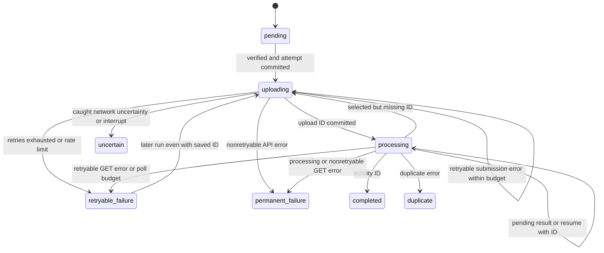
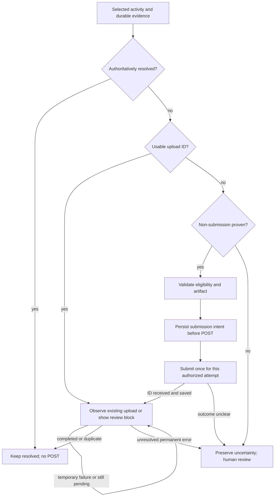

# SPEC-001: Strava Uploader Recovery & Idempotency

Status: Draft
Created: 2026-09-27
Approval: Pending human review; no behavioral decisions approved by this draft
Implementation plan: Not created; requires approval first
Supersedes: None
Investigation baseline: `1499448edfd42a32eb166c05306c607b9d6bf1b0`

This is an investigation and proposed behavioral contract under the
[SDD workflow](README.md). **CURRENT** describes the baseline implementation;
**PROPOSED** describes a target for review, not implemented behavior. Open questions
must be resolved before approval. Completion of this document does not mean that
SPEC-001 is Implemented or Verified.

## Problem

The uploader persists remote upload IDs, but recovery dispatch depends primarily on
the status label. A polling error or polling-budget exhaustion can leave
`retryable_failure` with a known upload ID; a later run sends another POST. An
interrupted POST can instead leave `uncertain` or `uploading`, and reset can erase
the evidence that should prevent resubmission. These paths need a precise recovery
contract before changing code.

## Motivation

Migration must preserve training history without creating avoidable duplicates.
Temporary inability to observe an upload must not be confused with evidence that
submission failed. Recovery should be explainable, durable and safe across repeated
runs, including workspaces written by the current version.

## Current behavior

### Evidence and boundaries of the investigation

The following source is authoritative for CURRENT statements at the baseline:

| Source | Investigated responsibilities |
| --- | --- |
| [strava/uploader.py](../strava/uploader.py) | `Uploader.__init__`, `select`, `verify`, `run`, `_submit`, `_poll_once`, `_before_request`, `_handle_status`; `ProcessingJob`, `sanitize_error` |
| [strava/client.py](../strava/client.py) | `StravaClient.upload`, `get_upload`, `_upload_response`, `_check_budget`, `access_token`, `_token_request`; `TokenStore`, `StravaAPIError`, rate-header parsing |
| [strava/state.py](../strava/state.py) | `UploadState`, schema version 1, `UploadStateStore.transaction`, `reconcile`, `set_status`, `reset`, `summary` |
| [strava/models.py](../strava/models.py) | `MigrationManifest.load`, `ManifestActivity.eligible`, `FitInfo`, `UploadStatus.upload_id`, token and rate models |
| [strava/rate_limit.py](../strava/rate_limit.py) | `RateLimitPolicy.before_request`, `DailyLimitReached`, `RateWait` |
| [strava/progress.py](../strava/progress.py) | `ProgressSnapshot`, `snapshot`, `progress_table`, `print_status` |
| [core/cli.py](../core/cli.py) | `strava_upload`, `strava_status`, `strava_reset`, `_state_store`, progress/rate callbacks |
| [services/migration.py](../services/migration.py) | Source-byte identity, `file_sha256`, manifest version and eligibility |
| [tests/test_strava_uploader.py](../tests/test_strava_uploader.py) | Synthetic workspace, `FakeClient`, `FakeClock`, HTTPX mocks; existing selection, persistence, retry, interruption, rate and progress coverage |

Read together with [architecture](../docs/architecture.md#uploader-and-persistence),
[uploader operations](../docs/strava-uploader.md),
[workspace contract](../docs/migration-workspace.md),
[troubleshooting](../docs/troubleshooting.md#upload-state),
[Python guidance](../docs/python-guidelines.md), [testing](../docs/testing.md),
[agent guidance](../AGENTS.md) and [security](../SECURITY.md).

Official API references checked on 2026-09-27, without authenticated requests:

- [Uploads guide](https://developers.strava.com/docs/uploads/): submission and
  processing are asynchronous; polling reports completion and errors, including
  duplicates. A polling interval of at least one second is recommended.
- [Uploads API reference](https://developers.strava.com/docs/reference/#api-Uploads):
  POST creates an upload; GET addresses a known upload ID. `external_id` is described
  as an external identifier, not an idempotency key. No idempotency-key guarantee or
  upload lookup by external ID is documented in the examined upload endpoints.
- [Rate limits](https://developers.strava.com/docs/rate-limits/): overall and read
  limits, natural quarter-hour resets, midnight UTC reset and HTTP 429.

The inference is deliberately limited: this application has no verified remote
idempotency or unknown-upload reconciliation mechanism. This is not proof that every
possible Strava service or support route lacks one. No live upload or account data
was used. Crash behavior below is control-flow/persistence analysis, not a claim of
tested power-loss durability or observed remote duplicate creation.

### Lifecycle and persistence ordering

1. The CLI requires exactly one of `--limit`, `--activity-id`, `--all`; date filters
   are optional. There is no separate resume command. Resume means another upload run.
2. `Uploader` loads manifest version 1, rejects duplicate stable IDs, and reconciles
   SQLite. New rows are `pending`, including ineligible rows. Changed FIT hash or
   eligibility and missing manifest entries become `local_file_changed`, even if
   previously completed. Remote IDs, attempt counts and completion timestamps survive.
3. `select` requires eligibility and a resolved start, then permits only `pending`,
   `retryable_failure`, `processing`. The limit counts the first two; matching
   processing entries are included beyond that limit. An explicit unselectable ID
   raises validation error. Every selected entry, including observation-only work,
   passes `verify`. A validation failure aborts selection rather than just omitting it.
4. `verify` requires valid FIT metadata, a workspace-contained resolved path, a file
   and matching SHA-256. Missing/hash-changed files persist `local_file_changed`.
   Invalid metadata/path raises without that update. FIT size is **not checked**.
5. `run` builds an in-memory polling job only for `processing` plus a truthy stored
   upload ID. Everything else in the selected list enters the submission queue,
   including `retryable_failure` with an ID and `processing` without an ID.
6. `_submit` verifies the file again, once before its entire retry loop. Rate policy
   runs before each attempt. `set_status(uploading, increment_attempt=True)` commits
   before the progress notification and before calling `client.upload`.
7. Inside the client: budget check, token load/possible refresh, then file open and
   multipart POST with `external_id=stable_activity_id`. Thus durable `uploading`
   does not prove that POST began. There is no transaction spanning SQLite and HTTP.
8. The client classifies the response. `_submit` obtains `result.upload_id` and
   commits `processing` plus that ID before a processing notification or any poll.
   It then handles an immediate terminal result in a separate transaction. There
   is a crash window between receiving the ID and committing it.
9. Synchronous GET calls observe queued remote processing. An activity ID completes
   the row. Otherwise an error containing `duplicate` (case-insensitive substring)
   resolves it as duplicate; another error is permanent failure. Without either,
   the textual `status` does not drive a transition and processing continues.
10. Each `set_status` commits independently. Omitted remote IDs are retained using
    `COALESCE`; supplied IDs can overwrite earlier IDs. Error/HTTP fields are replaced
    on each call, including cleared when omitted. No append-only attempt history is
    kept. Completion time is set for completed and otherwise retained.

Dry-run selects/verifies and can create/reconcile state but makes no API call. Its
output says `would_upload` even for selected processing entries. Local `status`
also reconciles state but does not hash files or contact Strava.

### Actual states

The store does not enforce legal transitions or validate every status/ID combination.
IDs in this table describe ordinary paths; inherited IDs can exist in almost any
state because updates retain them. Terminal means no automatic scheduler selection,
not immutable state; only completed and duplicate count as resolved.

| CURRENT state | Entry and meaning | Upload ID | Automatic next run / retry | Terminal or action needed |
| --- | --- | --- | --- | --- |
| `pending` | New reconciled row or explicit reset | Normally none; store can retain one through direct updates | Eligible, verified entries submit | Nonterminal; no action normally |
| `uploading` | Committed attempt intent before client call; also stranded failures/crashes | Normally absent on first attempt; may retain an older ID | Not selected or automatically reclassified | Unresolved/stalled; manual review then current reset |
| `processing` | Accepted POST ID saved; remote outcome not resolved | Normally present; no database constraint requires it | Verify local FIT, then poll if ID exists; otherwise submit | Nonterminal; missing ID is unsafe ambiguity |
| `completed` | Response has activity ID, taking precedence over error | Normally known, plus activity ID | Not selected | Resolved; current reset requires force |
| `duplicate` | Response error contains `duplicate`, without activity ID | Normally known; duplicate activity ID is not parsed from text | Not selected | Resolved; current reset requires force |
| `retryable_failure` | Exhausted retryable submission error, submission rate limit, retryable GET error, poll budget exhausted | May be known, especially after polling | Selected for another POST, even with ID | Nonterminal; unsafe to treat every row as safe submission |
| `permanent_failure` | Nonretryable API error, malformed response, or processing error | Depends on phase; retained if known | Not selected | Unresolved automatic stop; review/reset |
| `local_file_changed` | Missing/hash-changed FIT, changed hash/eligibility, removed manifest entry | Retained if known | Not selected | Unresolved automatic stop; artifact/manifest review |
| `uncertain` | Caught POST timeout/network error or interrupt inside submission try block | Usually absent, but may be retained if interruption occurs after ID persistence | Not selected | Unresolved automatic stop; reconcile/review, never blind reset |
| `skipped` | Defined enum value; no normal scheduler transition produces it | Store permits retained ID | Not selected | Unresolved automatic stop; no normal recovery path |

This shows ordinary scheduler transitions. Reconciliation can move any row to
`local_file_changed`; explicit reset moves any row to pending and clears IDs, with
force required only for completed/duplicate. `skipped` has no scheduler edge.
Hard termination can leave the last committed state without any new edge.

### Confirmed recovery gaps

- GET timeout/network errors, HTTP 5xx and HTTP 429 are retryable. `_poll_once`
  records `retryable_failure`, retains the upload ID and removes the in-memory job.
  Sixty successful still-processing polls (default) do the same with `poll_timeout`.
  On the next selected run `run` puts the row into the POST queue. The earlier
  upload may already have created an activity. Remote duplicate detection may catch
  the extra submission; it is not a verified exactly-once guarantee.
- GET 401/403, other unexpected HTTP responses and malformed responses produce
  `permanent_failure` with the ID retained. They are not automatically selected.
  Neither a GET failure nor a missing remote result proves the earlier POST failed.
- Submission HTTP 5xx is retried up to three client calls by default, sleeping
  one then two seconds. Between attempts state stays `uploading`; each attempt
  increments the counter. No evidence is recorded that the previous POST had no
  remote side effect. The same uncertainty principle applies here, not just to GET.
- POST `httpx.TimeoutException` and `httpx.NetworkError` become `uncertain`, without
  retry. This includes connect failures covered by those types, even if connection
  establishment in fact failed before transmission. Other exceptions, such as
  protocol errors, are not covered by this catch and may strand `uploading`.
- A malformed expected HTTP 201 becomes nonretryable `malformed_response` and hence
  permanent failure, although remote acceptance is possible. A valid model without
  `id`/`id_str` raises `ValueError` when its ID property is read, leaving `uploading`.
  Even an activity ID in that response is not handled before this property access.
- Token load/refresh/scope errors raise `ConfigurationError`; file-open errors can
  raise `OSError`. These occur after the uploading commit but may precede the upload
  POST; they are not converted to a phase-specific uploader state. CLI upload catches
  application errors, not every SQLite, HTTPX, value or filesystem exception.
- `reset` erases upload ID, activity ID and latest error/HTTP fields, sets pending,
  and retains attempts/timestamps/FIT hash. Uncertain, uploading and failed rows do
  not require force. A prior completed row reclassified by reconciliation as
  `local_file_changed` also loses the force guard. Reset never deletes remote data.

### Interruption, scheduling and reporting

Ctrl+C inside `_submit`'s try block writes `uncertain` and rethrows to `run`, which
sets an interruption stop reason. That block includes response processing, so an
interrupt can overwrite `processing` or even a just-written terminal status while
retaining IDs. The uploading commit and initial callback are outside that try block;
an interrupt there, or during retry backoff, can leave `uploading`. During polling,
rate waits and scheduler sleeps, `run` catches the interrupt and retains the last
committed state. This is not a graceful drain of every remote upload. Hard kill,
crash, machine restart and power loss do not run these handlers.

The scheduler is single-threaded with synchronous HTTP, interleaving independent
remote jobs. Default capacity is three; CLI permits one through ten. All selected
processing jobs are restored together, even if their count exceeds a newly lowered
capacity; new submissions wait until capacity permits. A failed poll removes a job
and frees local capacity although the remote upload may still be processing.
An unhandled exception can end the run and leave other rows at their last commits.
There is no cross-process workspace lock; two writers are outside current safety
guarantees and must not be mistaken for this bounded single-process pipeline.

Rate policy checks before each submission/poll; reads additionally use read limits.
Short-window reserve waits to the next quarter-hour plus one second; daily reserve
stops before that request. After a wait the observed snapshot is cleared. HTTP 429
stops the run; other processing rows retain their IDs. The client's own exhausted
budget check occurs before POST/GET and raises `rate_limit` without HTTP status;
submission special-cases it as retryable, polling uses its default nonretryable flag.
OAuth refresh is inside the client call, not a separately scheduled upload request.

Newly submitted jobs begin polling after at least one second (default two); resumed
processing jobs are immediately due for their first GET, subject to rate policy.
Subsequent intervals double to thirty seconds. The budget counts successful
still-processing polls, not all attempts. Restart rebuilds poll count/backoff in
memory. A transient polling error ends this job for this run, rather than using
the submission retry loop.

Progress counts completed plus duplicate as resolved. `needs_attention` counts
permanent failure, changed file and uncertain, but not stranded uploading or unsafe
retryable rows. `status --details` shows aggregate state counts, not per-activity
remote IDs, failure phase or recovery actions. A run can print a general safe-resume
message despite these distinctions. These are observable gaps, not new CLI behavior.

## Intended behavior

**PROPOSED central invariant:** Never create a new Strava upload while there is
evidence that an upload may already exist for that migration activity.

Evidence includes a known upload ID, uncertain POST, unfinished submission intent,
processing upload, completed activity and authoritative duplicate. A polling failure
is not submission failure. A network failure after POST begins is not proof that
POST failed. Retry permission must depend on evidence and phase, not a generic
retryable label. Evidence of an authoritatively failed attempt must explicitly
resolve its uncertainty before any new submission is permitted (Q1/Q2).

The target is duplicate-resistant automatic behavior and safe resume within an
intact workspace under one uploader process. It is not exactly-once delivery,
guaranteed remote completion, cross-workspace deduplication or crash-proof storage.
Remote duplicate detection is a final service response, not permission to retry.

| Situation | CURRENT | PROPOSED |
| --- | --- | --- |
| Retryable poll failure with ID | Next run can POST | Retain ID and resume observation only |
| Stranded uploading | Ignored until reset | Explain ambiguity; block POST unless non-submission is proven |
| Malformed successful POST / missing ID | Permanent failure or uncaught error | Preserve possible acceptance; review/reconciliation, no blind POST |
| POST 5xx | Automatic bounded resend | Do not infer safe resend from status code alone; resolve Q1 |
| Known ID and missing/changed local FIT | Selection blocks observation too | Block new submission; observation policy requires Q4 |
| Reset of uncertain/known-ID failure | Clears remote evidence | Preserve evidence; define explicit safe recovery actions under Q3 |
| Completed/duplicate | Not selected, but reconciliation/reset can overwrite evidence | Preserve resolved evidence across recovery and report local issues separately |

## Scope

Submission safety, observation/polling recovery, restart/resume, durable per-activity
upload evidence, retry classification, uncertainty, duplicate-safe automatic behavior,
reset safety, legacy-state compatibility and user-visible recovery status.

## Non-goals

Polar parsing, domain redesign, FIT/TCX generation, audit eligibility, manifest
schema or stable identity redesign, duplicate source-byte identity repair, lap
boundaries, OAuth redesign, token encryption/storage redesign, workspace locking,
GUI, CI, dependency cleanup, general performance work, rate-limit redesign and
Strava API expansion. Reconciliation research may identify future work; it does not
authorize new API calls/scopes in this draft. No remote deletion is proposed.

## Terminology

| Concept | Meaning; not a required enum or schema name |
| --- | --- |
| Submission | POST that creates a remote upload, distinct from its eventual activity |
| Observation | GET of a known upload ID; retry does not create another upload |
| Definitely not submitted | Evidence shows the upload POST never occurred and no prior unresolved attempt exists |
| Submission confirmed | Authoritative upload ID known; remote processing may still be pending or fail |
| Submission uncertain | POST may have been accepted, but usable authoritative outcome is absent |
| Authoritatively failed | Reliable evidence establishes an unsuccessful attempt; exact evidence allowing another POST is Q1/Q2 |
| Resolved | Authoritative completed activity or duplicate, not merely a local suspicion |
| Recovery evidence | IDs, submission/observation phase, outcomes and history needed to prevent unsafe retries |

## Architecture impact

The existing manifest-to-uploader boundary remains. No Polar parsing, generation or
eligibility moves into upload recovery. The uploader decides recovery actions; the
HTTP client reports phase-aware observations; the state store persists evidence;
CLI/progress explain actions without deciding migration semantics. These are roles,
not prescribed new classes or interfaces. Rate policy continues to govern both
submission and observation. Events must remain usable by future UI/API consumers.

Architecture review for approval must resolve persistence/legacy compatibility,
reset evidence, failure semantics and any contract changes between these components.
The existing integrity/privacy invariants apply. This investigation is not approval
of a state schema, API expansion or new dependency.

## Data and state impact

CURRENT schema 1 stores one row per stable activity ID, manifest version, FIT hash,
eligibility/presence, state, upload/activity IDs, attempts/times and latest HTTP/error
fields; metadata stores schema version and manifest fingerprint. It stores neither
FIT path/size nor an attempt-by-attempt ledger. SQLite transactions commit updates,
but the application specifies no custom journal/synchronous policy, cross-system
transaction, or recovery from database deletion/corruption.

PROPOSED: persist enough evidence to distinguish safe submission, observation and
review after restart. Preserve prior remote evidence when recording later errors,
artifact changes or reset requests. If a required pre-submission write fails, do
not POST. If saving a response fails, stop affected submission and retain the earlier
intent barrier; do not reconstruct a clean pending row. No schema is selected yet:
Q5 must decide whether interpretation changes suffice or versioned migration and
additional history are required. Source/domain/manifest schemas remain unchanged.

## Detailed behavior

### Proposed recovery routing

The observation self-edge represents bounded work separated by rate waits or later
runs, not an infinite loop. Artifact/manifest and authorization issues can block
observation under Q4/Q6; they must never divert a known ID to POST. Resolving a
review block requires the decisions below, not a hidden edge back to submission.

Proposed resume rules:

- Completed/duplicate evidence prevents automatic resubmission. Local metadata
  changes must not silently remove that protection.
- Processing or a retryable observation failure with a valid ID resumes GET of
  that same ID, with bounded polling and the existing rate policy.
- Known-ID authorization, malformed-response or permanent observation failures
  retain evidence and explain the review block; fixing access does not authorize POST.
- Uncertain or legacy uploading without proof of non-submission remains blocked.
  Restart alone does not turn uncertainty into retry permission.
- Retryable failures demonstrably before submission may retry after the cause is
  corrected, eligibility/integrity verified and no older unresolved attempt exists.
- Local-file-changed and permanent failure do not automatically submit. Missing ID
  in processing is invalid recovery evidence, not an invitation to create a new upload.
- Poll failures, budget exhaustion and rate pauses preserve the distinction between
  observation and submission across process boundaries and across other activities.

### Reset and reconciliation proposals

Ordinary reset must not erase uncertainty, known IDs or terminal evidence. A
definitely-not-submitted failure may be made retryable after correcting its cause.
Known-ID recovery should restore observation or request review. Uncertain outcomes
require reconciliation or an explicitly reviewed recovery policy. Completed and
duplicate remain protected; changed artifacts require integrity/identity review.
These are safety boundaries, not a chosen CLI design. Whether any deliberate
override is offered, what evidence it requires and how history is retained are Q3.
The existing `--force` switch must not silently be treated as sufficient proof.

## Error and recovery behavior

CURRENT persisted results are literal states. PROPOSED results below are conceptual
durable classifications, not schema choices. Prior evidence always dominates a new
failure that would otherwise look safe. "May exist" concerns remote upload/activity
creation, not merely whether the latest HTTP call returned success.

| Phase / example | May upload exist? / ID known? | CURRENT result and later behavior | PROPOSED safe action and durable result | User action? |
| --- | --- | --- | --- | --- |
| Preflight missing/hash-changed FIT | Not from this attempt; prior ID possible | `local_file_changed`; validation aborts | Block POST, preserve prior evidence and artifact issue | Correct/review artifact; observation Q4 |
| Invalid FIT metadata/path or unreadable file | Depends on prior evidence; no new ID | Validation/OSError; status may stay prior or `uploading` if file open fails inside client | Record pre-submission failure only when proven; no unsafe fallback | Correct local issue |
| HTTP OAuth failure before upload POST | No new upload from this attempt; prior ID possible | `ConfigurationError`; `uploading` or prior processing retained | Preserve phase, distinguish auth from upload; retry only allowed action after repair | Repair authorization |
| Rate policy daily/short reserve before request | No new effect; any prior ID retained | Stop without request / wait; current row unchanged | Keep evidence; stop or wait according to existing policy | Resume after daily reset |
| Client budget rejection before network | No new effect; prior ID possible | POST path `retryable_failure`; GET path may become `permanent_failure` | Preserve intended operation; never turn observation into submission | Resume under policy |
| POST HTTP 429 | Response indicates rate rejection; no ID from it; prior attempt may exist | `retryable_failure`, stop; later POST | Stop, preserve evidence; resubmit only if rejection is accepted as sufficient evidence under Q1 | Wait; review if earlier uncertainty |
| Connect failure before POST transmission | No new upload if provable; normally no new ID | Covered timeout/network errors become `uncertain` | Safe retry only with trustworthy non-submission evidence, otherwise uncertainty | Review when evidence unavailable |
| Timeout/connection loss during POST | Yes / usually no new ID | `uncertain`; no selection | Durable uncertainty, no automatic POST | Reconcile/review Q6 |
| Other unhandled transport/protocol error | Yes / possibly no ID | May escape with `uploading` | Conservative uncertainty after possible transmission | Review |
| POST 401/403 or other rejection | Depends on authoritative rejection and earlier attempts / no new ID | Nonretryable `permanent_failure` | Preserve evidence; no automatic retry without approved rejection classification Q1 | Repair/review |
| POST HTTP 5xx | Cannot establish absence / no new ID | Bounded repeats, then `retryable_failure` | No automatic resend from 5xx alone; uncertainty unless reliable evidence Q1 | Review unless proven safe |
| Expected success but malformed body or missing ID | Yes / unusable or missing | `permanent_failure` or uncaught `ValueError` leaving `uploading` | Preserve possible acceptance, no automatic POST | Reconcile/review |
| Successful POST with ID | Yes / yes | Commit `processing`, then handle result | Commit ID before observation; never repeat POST to recover GET | None for normal observation |
| GET network failure or 5xx | Yes / yes | `retryable_failure`, ID retained; next run POST | Retain observation-retry evidence; bounded GET now/later, same ID | Normally none beyond later resume |
| GET HTTP 429 | Yes / yes | `retryable_failure`, stop; next run POST | Preserve observation target, stop under rate policy | Resume later |
| GET auth, unexpected status, malformed result | Yes / yes | `permanent_failure`, ID retained | Retain ID, block or retry observation under classified cause; never POST | Repair/review; 404 is not proof of non-submission |
| Processing still pending / poll budget exhausted | Yes / yes | Processing then `retryable_failure` with ID | Defer observation while retaining ID and unresolved outcome | Later resume, bounded per run |
| Authoritative processing error | Upload exists; activity success failed per response / yes | `permanent_failure`, sanitized error | Preserve failed attempt and ID; any new submission policy Q2 | Review; no blanket retry |
| Authoritative duplicate result | Existing remote activity / normally upload ID | `duplicate`, ID/error retained; resolved | Resolved, never automatically POST; local suspicion alone insufficient | None for normal resume |
| Interruption | Depends on exact boundary / maybe | Last commit, or caught submission interrupt sets `uncertain` | Use crash matrix; preserve confirmed/uncertain evidence per activity | Review if ambiguous |
| Local FIT change after confirmed submission | Yes / yes | Selection can overwrite to `local_file_changed` and block GET | Block POST, retain remote evidence; observation Q4 | Artifact review separate from remote outcome |
| Malformed persisted state | Cannot safely infer / untrusted | Unsupported version rejected; invalid status can raise; processing without ID can submit; schema lacks transition validation | Fail closed for affected recovery, no automatic destructive repair or POST | Diagnose/reconcile Q5 |

## Crash/restart analysis

This matrix assumes the same intact workspace, no concurrent writer and no explicit
reset. "Commit" means the application transaction returned successfully. Filesystem,
hardware or database corruption can exceed that guarantee. CURRENT unhandled failures
and hard termination leave the last committed row; handlers cannot run after a kill.

| Interruption point | CURRENT durable state and restart | Ambiguity / duplicate risk | PROPOSED recovery |
| --- | --- | --- | --- |
| 1. Before durable pre-upload state | Prior pending/retryable row; later submit, or processing row takes GET route | Safe for a genuinely fresh row; a retryable row may already hide an upload | Examine all prior evidence; only proven non-submission can POST |
| 2. Intent committed, before POST | `uploading`; normally no ID; not selected | No POST actually occurred here, but restart cannot distinguish this from points 3-5; current manual reset removes the barrier | Preserve ambiguity; only proof of non-submission permits submission |
| 3. While POST is sent | Hard termination leaves `uploading`; caught in-try Ctrl+C writes `uncertain` | Remote acceptance unknown; reset/retry may duplicate | No blind resend; review/reconciliation |
| 4. Remote received POST, local response not handled | Same as point 3 | Remote upload may process successfully with no local ID | Preserve uncertainty; no claim that a timeout proves failure |
| 5. ID received, not committed | Normally `uploading`, no new durable ID; older ID may remain | Volatile knowledge lost; indistinguishable from uncertain send | Treat as uncertain unless authoritative reconciliation recovers ID |
| 6. ID committed | `processing` plus ID; next run verifies FIT then GET | Observation is possible; Ctrl+C in remaining submit try block may relabel uncertain while retaining ID | Preserve ID as recovery evidence; observe or review, never POST |
| 7. While polling | Normally processing plus ID and next run GET; a handled error may already have committed retryable/permanent failure | Retryable error followed by restart is current re-POST path | Preserve observation identity independent of status; retry GET only |
| 8. Terminal response received, terminal commit not completed | Prior processing plus ID; next run reobserves, unless prior error state differs | Activity may already exist; lack of terminal commit is not lack of success | Reobserve same ID; review if unavailable, never infer POST safety |

After a terminal commit, normal resume skips the row; a later interruption or
manifest reconciliation can still overwrite its label today. PROPOSED recovery
retains terminal evidence and reports any local issue separately. An atomic commit
with an unknown outcome must be inspected on reopen, not presumed absent. No local
ordering can eliminate the remote-acceptance/local-ID gap without additional remote
guarantees. A conservative blocked row is preferable to an invented exactly-once claim.

## Data integrity

Identity remains `sha256:` plus exact source bytes. Manifest entry, workspace-relative
FIT path, expected hash and optional size describe the artifact; state joins on stable
ID and stores hash/eligibility, not all manifest metadata. FIT SHA-256 is independent
of source identity. Byte-identical sources at different paths currently yield
duplicate manifest IDs and are rejected; source-byte edits produce a new identity.
These identity limitations are related future work, not solved by upload recovery.

CURRENT checks SHA-256 at selection and once on entry to `_submit`, not inside each
POST retry. The file is opened later; there is no immutable snapshot or lock. Size
is used for progress totals, not validation or reconciliation. Path/size-only changes
do not trigger `reconcile`'s hash/eligibility comparison.

PROPOSED: every permitted submission attempt must use an eligible artifact matching
the accepted manifest integrity contract, including after waiting/retrying. Never
use artifact replacement to discard remote evidence. Exact handling of size metadata
and the validation-to-send race is Q7. Known-ID observation does not transmit FIT
bytes; whether it can proceed despite local artifact issues is Q4. No source edits,
regeneration, identity merging or bypass of hash/path checks is authorized here.

## Security and privacy

Tokens stay in the token store, not uploader state, manifests, diagnostics or spec
examples. SQLite upload/activity IDs, timestamps, paths and error text are private
migration metadata. More recovery evidence must not become a raw HTTP/OAuth payload
log. Record safe categories and only the minimum necessary evidence. HTML stripping
and 500-character truncation in `sanitize_error` are not general secret redaction.
User-visible recovery output must avoid credentials and private payloads.

Token refresh failure must not erase submission knowledge. Reauthorization does not
prove a POST failed, and switching the authenticated athlete could make an old ID
unobservable; existing state has no athlete binding (Q6). Encryption, token storage
redesign and OAuth flow redesign remain separate work. Use only synthetic temporary
workspaces and mocked network failures for verification, per [SECURITY.md](../SECURITY.md).

## Compatibility

No existing database can be assumed clean. Opening current workspaces must not
automatically clear evidence or replay every retryable row. Interpretation changes
are required at minimum; whether a schema migration or one-time reconciliation is
also required remains an approval-blocking decision (Q5), not an implementation detail
to decide silently later.

| Legacy evidence | PROPOSED interpretation for review |
| --- | --- |
| Completed/duplicate | Keep authoritative resolution and IDs; no automatic submission |
| Processing with ID | Resume observation, subject to explicit review blocks |
| Retryable failure with ID | Treat as existing submission; do not POST from the retryable label |
| Uploading without usable ID | Ambiguous prior attempt; review, not clean pending |
| Uploading/uncertain with ID | Preserve ID; determine observation/review from evidence, never automatic POST |
| Uncertain without ID | Remain blocked pending reconciliation |
| Retryable failure without ID | Could represent a 5xx after acceptance; absence of ID is insufficient proof |
| Pending with attempt history or retained remote evidence | Could have been reset; legacy reset erased phase/IDs. Do not assume never submitted |
| Fresh pending, zero attempts, no conflicting evidence | Candidate for normal validated submission within intact-state assumptions |
| Permanent failure, including malformed POST response | Preserve ambiguity/ID; inspect phase where available before any retry |
| Local-file-changed or disappeared entry | Retain earlier resolution/IDs; current label may conceal completed history |
| Processing without ID, unknown status, corrupt/incompatible database | Block affected recovery; explicit diagnostic, no automatic clean-state recreation |

Schema 1's latest error and single ID cannot reconstruct erased history, multiple
attempts or lost IDs perfectly. Restoring a stale database or deleting it can remove
the barrier entirely; this spec cannot infer absent evidence. Q5 must define conservative
legacy handling and downgrade compatibility before approval. Manifest version, stable
IDs and ordinary CLI selectors remain; reset's safety semantics need explicit user
documentation and Q3 decisions. No migration or repair is performed in this sprint.

## Observability

PROPOSED local status/progress must distinguish resolved, awaiting observation,
safe submission retry, blocked uncertainty and other needs-review cases. Users must
be able to understand the reason and allowed next action for an affected activity.
Counts must not hide stranded uploading or ambiguous retryable rows as simply ready.
Polling failure must not be described as permission to re-upload. Dry-run must
distinguish observation from submission; status remains free of network requests.
Preserve aggregate progress and callback usability; exact wording/layout and how
per-activity detail is exposed are Q8, not a broader CLI redesign.

## Edge cases

- An interrupt or progress callback exception after an ID/terminal commit must not
  erase that evidence or authorize POST on resume.
- A retryable label with an older upload ID after multiple attempts must not silently
  pick a new POST; preserve ambiguity about other possible uploads for review.
- Missing/unusable IDs, conflicting activity/duplicate fields and unexpected response
  identity must not manufacture success or retry permission; Q9 defines trust rules.
- A manifest change can hide prior completion behind `local_file_changed`; a missing
  entry also disappears from the current eligible summary without deleting its row.
- A local read error or malformed row must not make another activity unsafe. Stopping
  the run is acceptable when integrity cannot be maintained; continued throughput is
  not more important than preserving each activity's evidence.
- Restart with more known uploads than the configured capacity must retain all IDs;
  recovering them must not create new submissions merely to fit the scheduler.
- 404, permission failure, changed authentication and absent search results are not
  proof that an earlier POST had no effect. Unavailable reconciliation stays visible.

## Acceptance criteria

These 18 criteria are **proposed**, not a claim that current code satisfies them.
Where they reference Q decisions, approval requires those choices and corresponding
criteria to be finalized; a question is not permission for an implementer to guess.

- **AC-01:** Given a valid known upload ID and no terminal result, recovery never
  sends a new POST merely because the status changed or observation failed; it uses
  that ID for permitted observation or reports a review block.
- **AC-02:** Poll network/HTTP failures, still-processing results and poll-budget
  exhaustion preserve remote evidence across restart and do not imply submission failure.
- **AC-03:** An uncertain POST, including possible acceptance followed by unusable
  response or interruption, is never automatically resent without approved evidence
  resolving uncertainty (Q1/Q6).
- **AC-04:** A retryable failure proven before submission, with no older unresolved
  attempt, can resume submission after correction and renewed integrity/rate checks;
  generic 5xx or retryable labels alone do not grant that permission (Q1).
- **AC-05:** Completed activity evidence remains resolved and prevents automatic
  resubmission across normal resume, reconciliation and local artifact issues.
- **AC-06:** Authoritative duplicate evidence remains resolved and prevents automatic
  resubmission; local duplicate suspicion alone never counts as authoritative resolution.
- **AC-07:** Changed, missing or invalid local FIT artifacts block unsafe POST and
  preserve remote evidence; known-ID observation follows the explicitly approved
  artifact policy (Q4/Q7).
- **AC-08:** Each crash/restart boundary in the matrix yields deterministic recovery
  from committed evidence: safe submission only when proven, otherwise observation or review.
- **AC-09:** Failure to persist submission intent prevents POST; known IDs are saved
  before polling. Restart after response-persistence failure never assumes a fresh attempt.
- **AC-10:** Multiple in-flight activities retain independent recovery evidence;
  one failure, rate stop or interruption cannot cause another to be resubmitted unsafely.
- **AC-11:** Recovery respects overall/read limits, reserve waits, daily stops,
  HTTP 429 stops and bounded polling; no retry loop bypasses these controls.
- **AC-12:** Graceful interruption stops scheduling and preserves confirmed/uncertain
  outcomes. Hard termination never relies on cleanup handlers to make resend safe.
- **AC-13:** Reset/recovery actions preserve historical evidence relevant to duplicate
  prevention and obey the approved per-category policy, including any deliberate
  override; ordinary reset never silently clears the resend barrier (Q3).
- **AC-14:** Existing schema-1 workspaces are handled according to a reviewed legacy
  mapping, including reset history, retained IDs and ambiguous no-ID rows; required
  migration/reconciliation/downgrade behavior is defined before implementation (Q5).
- **AC-15:** Malformed state, missing required IDs and contradictory response evidence
  cause a safe diagnostic/review block, never an automatic fallback POST (Q5/Q9).
- **AC-16:** Local status/progress and dry-run distinguish submission, observation,
  uncertainty, review and resolution with understandable next actions and correct
  review counts, without network access for status/dry-run (Q8).
- **AC-17:** Recovery diagnostics, state and examples contain no tokens, secrets or
  raw private payloads; authentication repair preserves upload evidence and does not
  itself authorize resubmission (Q6).
- **AC-18:** Authoritative processing failures retain the failed upload evidence;
  subsequent retry eligibility follows an explicitly approved failure policy, not
  automatic reuse of a generic permanent/retryable label (Q2).

## Verification

Future verification should use synthetic workspaces, reopened SQLite databases,
fake clocks, injected interruption/persistence failures and mocked HTTP. Assert both
observable outcomes and which POST/GET operations occurred; a terminal state alone
can conceal a duplicate submission. Do not send real uploads to reproduce a risk.

| Criteria | Proposed evidence after approval and implementation |
| --- | --- |
| AC-01, AC-02 | GET network/5xx/429/auth/malformed and poll-budget cases; reopen store, resume; assert retained ID, no extra POST and permitted GET of same ID |
| AC-03, AC-04 | Phase-specific connect/preflight/OAuth failures, timeout during POST, 5xx, malformed 201, missing ID; assert retry permission matches evidence/Q1, including older attempts |
| AC-05, AC-06 | Completed/duplicate responses, local suspicion, regenerated/removed entries and restart; assert resolution evidence retained and no automatic POST |
| AC-07 | Missing/hash-changed/path-invalid/size-mismatched artifacts and changes during a wait; known-ID cases follow Q4/Q7; assert no unsafe bytes submitted |
| AC-08, AC-09 | Inject interruption at all eight matrix boundaries, fail state commits, reopen; inspect durable evidence and exact subsequent network operations; no power-loss guarantee inferred from mocks |
| AC-10, AC-12 | Mixed multi-activity batches; Ctrl+C during submission/poll/wait/callback, simulated abrupt exit and resume with lower capacity; assert per-activity safety |
| AC-11 | Fake clock/header fixtures for overall/read reserve, quarter-hour waits, daily stop, HTTP 429 and repeated pending results; assert bounded requests and preserved IDs |
| AC-13 | Reset matrix over no-submission, ID-known, uncertain, completed, duplicate, permanent and changed-file states; reopen and verify history and allowed action under Q3 |
| AC-14, AC-15 | Synthetic schema-1 databases for every compatibility row, invalid statuses/IDs, erased legacy reset history and conflicting responses; verify approved migration/refusal and no automatic repair-to-pending |
| AC-16 | CLI/callback snapshots for observation, retry and review outcomes; assert counts/action meaning, dry-run distinction and zero status/dry-run network calls |
| AC-17 | Synthetic secret markers in mocked OAuth/HTTP failures and recovery reports; assert no leakage and no evidence loss on token repair/account mismatch policy |
| AC-18 | Processing errors, authorization errors and other observation failures distinguished; verify Q2-approved review/retry path and retained prior attempt evidence |

Existing tests establish parts of CURRENT behavior: successful persistence and
no-repeat selection, processing-ID resume, bounded submission retry, uncertain
client error, completed-reset force, FIT hash/missing detection, rate policy and
pipeline capacity. In particular `test_retry_is_bounded` expects repeated POSTs for
503; that expectation is evidence of current behavior, not authority for the target.
`test_keyboard_interrupt_preserves_resumable_state` injects an interrupt in upload;
it does not cover every interrupt window or hard termination. No current test proves
safe restart after polling failure, reset of uncertainty, or power-loss recovery.

Record future per-AC results and limitations in Completion, run focused checks and
all [required validation](../docs/testing.md#setup-and-required-checks), then perform
a separate specification compliance review. Passing today's suite does not verify
these proposed criteria.

## Implementation notes

No final implementation plan is included or authorized. Possible approaches for
human review are (a) interpreting existing phase/error/ID evidence conservatively,
with legacy review blocks, or (b) persisting more precise attempt/recovery evidence
with versioned compatibility handling. The first is smaller but cannot recover
history already erased; the second can improve future evidence but cannot reconstruct
unknown past remote outcomes either. The draft recommends evidence-based routing
and preservation in either approach. Exact schema, classes, exceptions, interfaces,
sequencing and migration mechanics belong to the plan after Q decisions and approval.

## Open questions

All questions are unresolved. Recommendations are proposals for review, not decisions.

| ID | Human decision required | Options / provisional recommendation |
| --- | --- | --- |
| Q1 | What proves a POST had no side effect, including 429, other HTTP rejection, 5xx and connection failure? | Approve explicit evidence rules by phase/status; recommend no resend for 5xx or transport uncertainty alone. Decide which rejection/connect evidence is sufficient and how earlier ambiguous attempts dominate it. |
| Q2 | When may an authoritatively failed processing upload permit a new submission? | Keep all such cases review-only, or allow explicitly classified failures after resolving the prior attempt. Recommend review-only until precise evidence is agreed; an old ID/history must remain traceable. |
| Q3 | What may ordinary reset and any deliberate override do for each evidence category? | Reject unsafe reset; restore observation; or offer an explicit reviewed override with retained history and clearly defined evidence/confirmation. Recommend ordinary reset never erase evidence. Decide whether risk acknowledgment alone can ever permit a deliberate resend and whether that requires narrowing the invariant explicitly. |
| Q4 | May a known upload continue observation when the FIT is missing/changed or the manifest entry is ineligible/removed? | Recommend separate artifact review from remote observation, retaining terminal evidence. Define eligibility/selection and progress handling without re-enabling submission or silently changing audit eligibility. |
| Q5 | What durable representation and legacy upgrade policy will preserve enough evidence? | Decide interpretation-only versus schema migration/history, ambiguous legacy pending/retryable rows, malformed-state handling, one-time review/repair and downgrade behavior. Recommend conservative blocks where schema 1 cannot prove safety; no clean-database assumption. |
| Q6 | What reconciliation is supported for uncertain no-ID outcomes, unavailable IDs and changed authentication? | Manual review only, or separately researched scoped reconciliation. Define acceptable proof, identity/account assumptions and next actions; do not infer absence from search/timestamps alone. Recommend no new scopes/endpoints in SPEC-001 without explicit scope review. |
| Q7 | What artifact contract applies at each allowed POST boundary? | Define when size mismatch is blocking versus advisory and how validated bytes remain tied to submitted bytes across waits/retries. Retain containment/SHA-256 checks; choose a guarantee achievable without expanding into workspace locking. |
| Q8 | How should recovery actions and review counts appear through existing CLI/status/progress interfaces? | Decide minimum per-activity reasons, aggregate categories, dry-run action labels and selector/limit treatment for observation retries. Recommend preserving existing selectors while ensuring observation is not mislabeled as submission. |
| Q9 | What response evidence is authoritative for completion/duplicate and usable upload identity? | Review current substring duplicate matching and activity-ID precedence, missing/mismatched IDs and contradictory fields. Define conservative recognition without guessing success, discarding known IDs or inventing a remote contract. |

## Decision log

- 2026-09-27: Sprint 10.3A authorizes investigation and a Draft only; no implementation,
  final plan or approval is recorded. Repository SDD governs later approval and planning.
- 2026-09-27: Existing architecture fixes the prepared manifest/FIT boundary; this
  specification does not redesign parsing, generation, identity or eligibility.
- 2026-09-27: Existing repository safeguards and the sprint require no blind resend
  after uncertain POST. Submission and observation are distinguished because the
  current client uses separate POST-create and GET-by-ID operations.
- 2026-09-27: CURRENT findings are anchored to the baseline commit above. The proposed
  invariant, recovery policies and ACs remain subject to human review; Q1-Q9 are open.

## Completion

- Draft artifact: SPEC-001 investigation and proposed contract; no implementation commit.
- Implementation and per-AC satisfaction: Not performed; all 18 target ACs await
  decision finalization, approval, implementation and verification.
- Draft validation (2026-09-27): `python -m pytest` passed 103 tests; `ruff check .`,
  `black --check .` (60 files) and `mypy .` (60 files) passed. All 20 local links/anchors
  resolve; both Mermaid diagrams were manually checked. Scope/privacy review found
  only this new Markdown file, with no personal data or generated artifacts. These
  checks validate the unchanged repository and draft, not proposed recovery behavior.
- Specification compliance: Draft reviewed for coverage/current-versus-proposed
  separation; final implementation compliance review has not occurred.
- Intentional deviations/approval: None approved; unresolved choices are Q1-Q9.
- Architecture/user documentation: Current implementation guides remain unchanged;
  operational documentation must be updated when approved behavior is implemented.
- Follow-up: Human review and resolution of open questions, explicit approval, then
  an implementation plan. No push, merge, release or live migration in this sprint.
